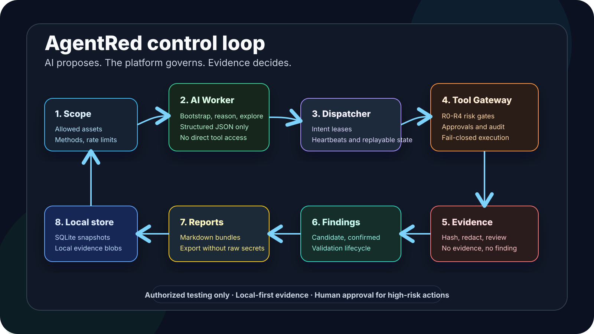
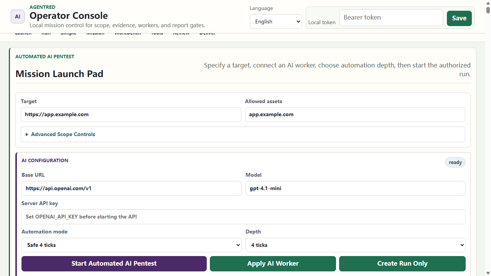
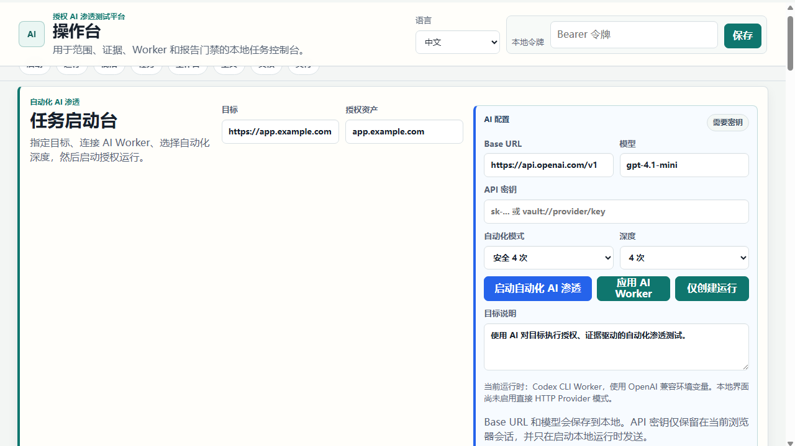
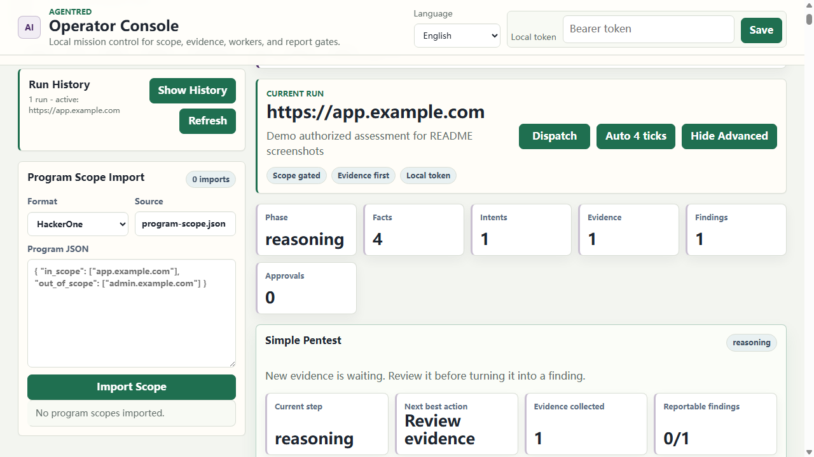
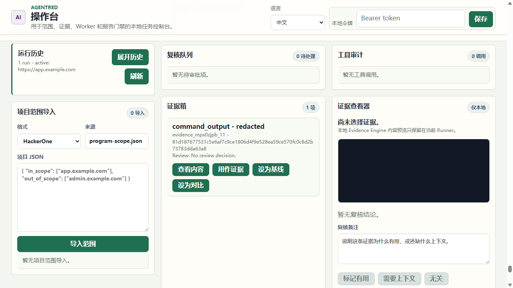
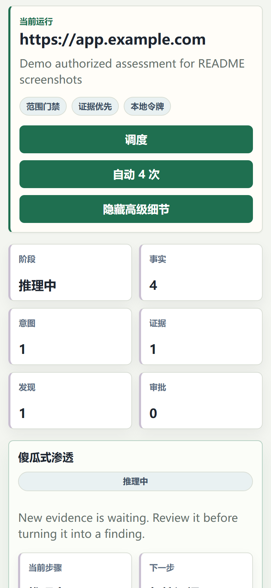
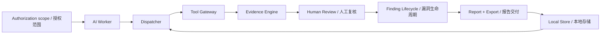

# AgentRed

<p align="center">
  
</p>

<p align="center">
  <strong>Local-first AI red team workbench for authorized, evidence-driven security assessments.</strong><br>
  <strong>本地优先、证据驱动、带安全门禁的 AI 红队评估工作台。</strong>
</p>

<p align="center">
  <a href="https://github.com/Coff0xc/AgentRed/actions/workflows/ci.yml"></a>
  <a href="package.json"></a>
  <a href="package.json"></a>
  <a href="LICENSE"></a>
  <a href="SECURITY.md"></a>
</p>

<p align="center">
  <a href="#screenshots--使用截图">Screenshots</a> |
  <a href="#quick-start--快速开始">Quick Start</a> |
  <a href="#how-it-works--工作原理">How It Works</a> |
  <a href="#security-model--安全模型">Security Model</a> |
  <a href="#api-walkthrough--api-操作示例">API</a> |
  <a href="#roadmap--路线图">Roadmap</a>
</p>

---

## What AgentRed Is / AgentRed 是什么

AgentRed turns AI-assisted red-team work into a governed engineering workflow:

```text
Authorization scope -> AI reasoning -> Policy-gated tools -> Evidence -> Human review -> Findings -> Reports
```

AgentRed 把 AI 辅助红队工作变成一条可治理、可审计、可交付的工程流水线：

```text
授权范围 -> AI 推理 -> 工具门禁 -> 证据留存 -> 人工复核 -> 漏洞生命周期 -> 报告交付
```

It is not a "give the model a shell and hope" project. AI Workers propose structured actions. The Dispatcher owns run state. The Tool Gateway enforces scope, risk, approval, rate, and tool policy. Evidence is hashed, redacted, reviewed, and tied to reportable findings.

它不是“给大模型一个 shell 然后祈祷”的项目。AI Worker 只提出结构化建议；Dispatcher 负责状态推进；Tool Gateway 负责范围、风险、审批、速率和工具策略；Evidence Engine 负责哈希、脱敏、复核和报告链路。

> AgentRed is for authorized security testing, defensive validation, and local evidence workflows only.
>
> AgentRed 只用于明确授权的安全测试、防御验证和本地证据工作流。

---

## Screenshots / 使用截图

The screenshots below use the local README demo run (`https://app.example.com`). Token fields are placeholders or password-masked; no live credentials are shown.

以下截图使用本地 README 演示任务（`https://app.example.com`）。令牌输入框为空、占位或密码掩码，不展示真实凭据。

### Full Console / 完整控制台


Use the local console to create runs, watch mission progress, dispatch AI workers, and keep the next safe action visible.

通过本地控制台创建任务、查看任务进度、推进 AI Worker，并始终看到下一步安全动作。

### Mission Launch / 任务启动

| English UI | 中文界面 |
| --- | --- |
|  |  |
| Target, scope, worker model, automation depth, and "create run only" stay in one launch surface. | 目标、授权范围、Worker 模型、自动化深度和“仅创建运行”集中在同一个启动界面。 |

### Active Run / 当前任务



The active-run view keeps the operator on the control loop: current phase, facts, intents, evidence, findings, approvals, and the next review action.

当前任务视图强调控制闭环：阶段、事实、意图、证据、发现、审批，以及下一步需要复核的动作。

### Evidence Review / 证据复核

Evidence is reviewed before it can become a reportable finding. Raw local evidence stays local by default.

证据必须先复核，才能进入可报告漏洞链路。默认不把 raw local evidence 当作可导出材料。

| English UI | 中文界面 |
| --- | --- |
|  |  |
| Evidence Inbox, Evidence Viewer, review notes, and "Mark useful / Needs context / Not relevant" keep human judgment explicit. | 证据箱、证据查看器、复核备注和“标记有用 / 需要上下文 / 无关”动作，让人工判断写入链路。 |

### Mobile Console / 移动端控制台



The responsive layout keeps the same mission controls available on narrow screens: current run, dispatch, metrics, and evidence-first progress.

窄屏布局保留同样的任务控制能力：当前任务、调度按钮、关键指标，以及证据优先的推进状态。

Screenshot highlights / 截图重点：

- **Run History / 运行历史** keeps local assessments visible.
- **Mission Launch / 任务启动** keeps target, authorization, worker, and automation depth together.
- **Mission cards / 任务卡片** show current step, next action, evidence count, and report readiness.
- **Evidence Review / 证据复核** records operator judgment before findings become reportable.
- **Local token / 本地令牌** is used only by the local UI session; the static shell does not grant data access by itself.

---

## Why It Exists / 为什么做 AgentRed

Security teams do not need an uncontrolled AI that can run every tool. They need repeatable assessments with:

- signed authorization boundaries
- explainable tool decisions
- human approval for high-risk actions
- evidence-backed findings
- redacted local artifacts
- report-ready exports
- measurable worker quality

安全团队需要的不是一个能乱跑工具的 AI，而是一套可重复、可复核、可交付的评估系统：

- 明确授权边界
- 工具调用可解释
- 高风险动作人工审批
- 漏洞必须绑定证据
- 本地证据脱敏留存
- 报告和导出可交付
- Worker 质量可评估

AgentRed is the control plane between "AI can reason" and "security work must be governed".

AgentRed 是“AI 能推理”和“安全工作必须可治理”之间的控制层。

---

## Core Capabilities / 核心能力

| Area | English | 中文 |
| --- | --- | --- |
| Local platform | REST API, Operator Console, SQLite/local state, in-memory test store | REST API、本地控制台、SQLite/本地状态、测试内存存储 |
| AI workers | Mock, CLI, Claude worker, `agent-worker.v1` envelope, worker selection previews | Mock、CLI、Claude Worker、`agent-worker.v1` 协议、Worker 选择预览 |
| Dispatch | Bootstrap/reason/explore loop, intent leases, heartbeats, multi-round explore limits | Bootstrap/reason/explore 循环、intent lease、heartbeat、多轮 explore 上限 |
| Safety gates | ScopePolicy, allow/deny assets, allowed methods, R0-R4 risk levels, approvals, rate limits | ScopePolicy、资产 allow/deny、HTTP 方法、R0-R4 风险等级、审批、速率限制 |
| Tool governance | Tool Gateway, scanner templates, MCP bundle governance, poison detection, sandbox checks | Tool Gateway、扫描模板、MCP Bundle 治理、投毒检测、沙箱检查 |
| Evidence | Local blobs, SHA-256 hashes, redaction state, review workflow, replay bundles | 本地证据 blob、SHA-256、脱敏状态、复核流程、replay bundle |
| Findings | Candidate/confirmed/rejected states, duplicate handling, validation lifecycle | candidate/confirmed/rejected、重复处理、验证生命周期 |
| Reports | Markdown reports, run exports, confirmed-only delivery gates | Markdown 报告、run export、confirmed-only 交付门禁 |
| Runtime UX | WebSocket progress, mission control, local runner workbench, runtime readiness | WebSocket 实时进度、Mission Control、本地 Runner 工作台、运行时就绪检查 |
| Evaluation | Benchmarks, scorecards, worker leaderboard, cost/quality telemetry | 基准测试、评分卡、Worker 排行、成本/质量遥测 |

---

## Quick Start / 快速开始

### Requirements / 环境要求

```text
Node.js >= 24.0.0
npm
```

### Install / 安装依赖

```bash
npm ci
```

### Verify / 验证项目

```bash
npm run typecheck
npm test
npm run build
```

### Run the local API / 启动本地 API

Linux / macOS:

```bash
PLATFORM_API_TOKEN=local-dev-token npm run dev
```

PowerShell:

```powershell
$env:PLATFORM_API_TOKEN = "local-dev-token"
npm run dev
```

Open the console:

```text
http://127.0.0.1:4317/app
```

Notes:

- `PLATFORM_API_TOKEN` is required.
- The service refuses to synthesize or print a token.
- `/` and `/health` are unauthenticated.
- API data and mutations require `Authorization: Bearer <token>` or `X-Platform-Token: <token>`.

注意：

- 必须设置 `PLATFORM_API_TOKEN`。
- 服务不会自动生成或打印 token。
- `/` 和 `/health` 不需要认证。
- API 数据和变更接口需要 `Authorization: Bearer <token>` 或 `X-Platform-Token: <token>`。

---

## API Walkthrough / API 操作示例

Create a local authorized run with the mock worker:

使用 mock worker 创建一条本地授权任务：

```bash
curl -X POST http://127.0.0.1:4317/runs \
  -H "Authorization: Bearer $PLATFORM_API_TOKEN" \
  -H "Content-Type: application/json" \
  -d '{
    "target": "https://app.example.com",
    "goal": "Produce an evidence-backed assessment report",
    "scopePolicy": {
      "allowedAssets": ["app.example.com", "*.example.com"],
      "deniedAssets": ["admin.example.com"],
      "allowedMethods": ["GET", "POST"],
      "destructiveAllowed": false,
      "credentialRules": { "allowVaultReferencesOnly": true },
      "rateLimits": { "requestsPerMinute": 120 }
    },
    "workerPool": [
      {
        "name": "mock-worker",
        "type": "mock",
        "maxRunning": 1,
        "priority": 0,
        "timeoutMs": 60000
      }
    ]
  }'
```

Useful routes:

常用接口：

| Action | Route |
| --- | --- |
| Health check / 健康检查 | `GET /health` |
| Open console / 打开控制台 | `GET /app` |
| List runs / 列出任务 | `GET /runs` |
| Run graph / 查看图状态 | `GET /runs/{id}/graph` |
| Progress summary / 进度摘要 | `GET /runs/{id}/progress` |
| Mission control / 任务总览 | `GET /runs/{id}/mission-control` |
| Worker envelope preview / Worker 输入预览 | `GET /runs/{id}/worker-envelope/preview` |
| Dispatch once / 推进一步调度 | `POST /runs/{id}/dispatch` |
| Autopilot step / 自动推进一步 | `POST /runs/{id}/autopilot/tick` |
| Tool plan preview / 工具门禁预览 | `POST /runs/{id}/tools/plan` |
| Tool invoke / 工具调用 | `POST /runs/{id}/tools` |
| Create checkpoint / 创建检查点 | `POST /runs/{id}/checkpoint` |
| List checkpoints / 查看检查点 | `GET /runs/{id}/checkpoints` |
| Restore checkpoint / 恢复检查点 | `POST /runs/{id}/checkpoint/restore` |
| Review evidence / 复核证据 | `POST /evidence/{id}/review` |
| Validate finding / 验证漏洞 | `POST /findings/{id}/validation` |
| Generate report / 生成报告 | `POST /reports` |
| Export run / 导出交付包 | `POST /runs/{id}/exports` |

Full API reference: [docs/API.md](docs/API.md)

完整 API 文档：[docs/API.md](docs/API.md)

---

## How It Works / 工作原理

### Control loop / 控制闭环



### Responsibility split / 职责拆分

| Component | English | 中文 |
| --- | --- | --- |
| AI Worker | Reads the governed envelope and proposes JSON decisions. It cannot write graph state or execute tools directly. | 读取受控上下文并返回 JSON 决策，不能直接写图状态或执行工具。 |
| Dispatcher | Claims intents, manages leases, advances bootstrap/reason/explore, and releases stuck work. | 领取 intent、管理 lease、推进 bootstrap/reason/explore，并释放卡住任务。 |
| Tool Gateway | Enforces scope, risk, approval, rate limits, and tool allowlists before execution. | 在执行前检查范围、风险、审批、速率和工具白名单。 |
| Evidence Engine | Stores local evidence metadata, hashes, redaction state, and review-ready content pointers. | 存储本地证据元数据、哈希、脱敏状态和复核内容指针。 |
| Finding Service | Requires evidence before candidate findings and human validation before delivery readiness. | 漏洞必须绑定证据，交付前必须经过人工验证。 |
| Report / Export | Generates hashable report bundles while excluding raw local-only evidence by default. | 生成可哈希报告包，默认排除 raw local-only 证据。 |

---

## Security Model / 安全模型

AgentRed fails closed. If a decision is ambiguous, the platform blocks or asks for approval.

AgentRed 默认 fail-closed。只要决策不明确，平台就阻断或要求审批。

### Risk levels / 风险等级

| Level | Meaning | Default behavior |
| --- | --- | --- |
| `R0` | Metadata, passive reads, internal organization / 元数据、被动读取、内部整理 | Allowed when locally valid / 本地合法即可 |
| `R1` | Normal HTTP/browser action / 普通 HTTP 或浏览器动作 | Must be in scope / 必须在授权范围内 |
| `R2` | Scanning, bounded fuzzing, active probing / 扫描、有限 fuzzing、主动探测 | Scope, rate, and policy gated / 范围、速率和策略门禁 |
| `R3` | Exploit validation, OAST, state change, role comparison / 利用验证、OAST、状态变化、跨角色测试 | Human approval required / 必须人工审批 |
| `R4` | Destruction, credential theft, persistence, exfiltration, brute force / 破坏、凭据窃取、持久化、外传、暴力破解 | Denied by default; break-glass requires token plus approval / 默认拒绝；break-glass 也需要 token 和审批 |

### Hard boundaries / 硬边界

- Out-of-scope assets are blocked before tool execution.
- Denylist overrides allowlist.
- Unsupported HTTP methods are blocked.
- Unsupported tools are blocked.
- R3 requires approval.
- R4 requires matching break-glass token and approval.
- Findings without evidence are rejected.
- Reports default to confirmed findings only.
- Raw local-only evidence is not exported by default.
- Worker environment values that look like secrets are rejected.

中文边界：

- 越界资产在工具执行前阻断。
- denylist 优先于 allowlist。
- 未允许 HTTP 方法阻断。
- 未注册工具阻断。
- R3 必须审批。
- R4 必须匹配 break-glass token 且审批通过。
- 没有证据的 finding 会被拒绝。
- 报告默认只包含 confirmed findings。
- raw local-only evidence 默认不导出。
- Worker env 中疑似 secret 的值会被拒绝。

Read more: [docs/SECURITY_MODEL.md](docs/SECURITY_MODEL.md)

更多说明：[docs/SECURITY_MODEL.md](docs/SECURITY_MODEL.md)

---

## Worker Modes / Worker 使用方式

### Mock worker / Mock Worker

Use this for local smoke tests and workflow validation.

适合本地 smoke test 和流程验证。

```json
[
  {
    "name": "mock-worker",
    "type": "mock",
    "maxRunning": 1,
    "priority": 0,
    "timeoutMs": 60000
  }
]
```

### Claude worker / Claude Worker

Install the SDK and provide the API key through the local process environment:

安装 SDK，并通过本地进程环境变量提供 API key：

```bash
npm install @anthropic-ai/sdk
export ANTHROPIC_API_KEY=your-key
export CLAUDE_MODEL=claude-sonnet-4-5
```

PowerShell:

```powershell
npm install @anthropic-ai/sdk
$env:ANTHROPIC_API_KEY = "your-key"
$env:CLAUDE_MODEL = "claude-sonnet-4-5"
```

Worker pool:

```json
[
  {
    "name": "claude-op",
    "type": "claude",
    "maxRunning": 1,
    "priority": 1,
    "timeoutMs": 90000
  }
]
```

Important:

- Do not put model API keys into `workerPool.env`.
- Worker output is still structured JSON.
- Tool execution still goes through Dispatcher and Tool Gateway.

注意：

- 不要把模型 API key 写进 `workerPool.env`。
- Worker 输出仍然必须是结构化 JSON。
- 工具执行仍然必须经过 Dispatcher 和 Tool Gateway。

---

## Optional Runners / 可选运行时

### Playwright browser runner / Playwright 浏览器 Runner

Default install does not force browser binaries. Enable Playwright only when you need rendered DOM, screenshots, console, and network summaries.

默认安装不会强制下载浏览器二进制。只有需要 DOM 渲染、截图、console 和 network 摘要时再开启 Playwright。

```bash
npm install --no-save playwright
npx playwright install chromium
PLATFORM_API_TOKEN=local-dev-token PLATFORM_ENABLE_PLAYWRIGHT_RUNNER=1 npm run dev
```

PowerShell:

```powershell
npm install --no-save playwright
npx playwright install chromium
$env:PLATFORM_API_TOKEN = "local-dev-token"
$env:PLATFORM_ENABLE_PLAYWRIGHT_RUNNER = "1"
npm run dev
```

Playwright evidence rules:

- Initial target, final URL, and renderer subrequests are scope-checked.
- Out-of-scope navigation is blocked before evidence storage.
- Screenshots are `raw_local_only`.
- DOM text, console, and network summaries are redacted before storage.

Playwright 证据规则：

- 初始目标、最终 URL 和浏览器子请求都走 scope 检查。
- 越界跳转在证据保存前阻断。
- 截图证据标记为 `raw_local_only`。
- DOM 文本、console、network 摘要保存前脱敏。

### External toolbox / 外部工具箱

External scanners fail closed unless explicitly enabled by environment variables and allowlists.

外部扫描器默认 fail-closed，必须通过环境变量和 allowlist 显式启用。

```bash
PLATFORM_API_TOKEN=local-dev-token \
PLATFORM_ALLOW_EXTERNAL_TOOLBOX=1 \
PLATFORM_ALLOWED_SCANNER_TEMPLATES=web.nuclei.safe_templates \
PLATFORM_ENABLE_CONTAINER_TOOLBOX=1 \
npm run dev
```

---

## Project Layout / 项目结构

```text
.
|-- src/
|   |-- api/             REST API and local Operator Console
|   |-- dispatcher/      Worker dispatch, intent leases, multi-round explore
|   |-- workers/         Worker protocol, Mock, CLI, Claude
|   |-- tools/           Tool Gateway, scanner templates, toolbox policy
|   |-- graph/           Run graph state
|   |-- evidence/        Evidence hashing, redaction, local content access
|   |-- findings/        Finding creation and validation
|   |-- reports/         Reports and run exports
|   |-- scope/           ScopePolicy and cache
|   |-- storage/         In-memory, SQLite, indexed store
|   |-- observability/   Scorecards, cost, quality, supervision
|   `-- index.ts         Dev server entrypoint
|-- tests/               Regression and integration tests
|-- docs/                API, architecture, security model, roadmap
|-- docs/assets/         README screenshots and diagrams
|-- benchmarks/          Reference benchmark scenarios
|-- docker/              Sandbox and vulnerable-lab helpers
|-- examples/            Local demo clients
|-- package.json
|-- tsconfig.json
`-- README.md
```

---

## Secrets Review / 敏感信息检查

Latest local review performed for this README refresh:

- Checked current tracked files for strong secret patterns such as Stripe keys, GitHub PATs, AWS access keys, Google API keys, Slack tokens, private-key headers, and common bearer-token shapes.
- Checked Git history for the same high-confidence patterns.
- Reviewed broader `token/password/secret/api_key` matches and classified them as code variables, documentation placeholders, or test fixtures.
- Confirmed `.env*`, local databases, logs, HAR files, certificates, keys, and browser profile state are ignored by `.gitignore`.
- GitHub Secret Scanning alert API returned `403` for the current token, so remote alert state was not readable from this environment.

本次 README 优化前做了本地敏感信息检查：

- 扫描当前 tracked 文件中的 Stripe、GitHub PAT、AWS、Google、Slack、私钥头、常见 bearer token 等强特征密钥。
- 扫描 Git 历史中的同类高置信特征。
- 对更宽泛的 `token/password/secret/api_key` 命中进行分类，主要是代码变量、文档占位符或测试 fixture。
- 确认 `.env*`、本地数据库、日志、HAR、证书、私钥和浏览器 profile 状态已被 `.gitignore` 覆盖。
- 当前 `gh` token 对 GitHub Secret Scanning alerts API 返回 `403`，因此本环境无法读取远端 secret alert 状态。

No high-confidence committed secret was found by the local scans above.

以上本地扫描未发现高置信已提交真实密钥。

---

## Documentation / 文档

| Document | Description / 说明 |
| --- | --- |
| [docs/API.md](docs/API.md) | REST and WebSocket API reference / REST 与 WebSocket API |
| [docs/ARCHITECTURE.md](docs/ARCHITECTURE.md) | Platform architecture and data model / 平台架构与数据模型 |
| [docs/SECURITY_MODEL.md](docs/SECURITY_MODEL.md) | Fail-closed rules and evidence handling / fail-closed 规则和证据处理 |
| [docs/MATURITY_ROADMAP.md](docs/MATURITY_ROADMAP.md) | Product maturity plan / 产品成熟路线图 |
| [docs/ENTERPRISE_PENTEST_AGENT_WORKFLOWS.md](docs/ENTERPRISE_PENTEST_AGENT_WORKFLOWS.md) | Enterprise workflow design / 企业级评估工作流 |
| [docs/SANDBOX_ISOLATION.md](docs/SANDBOX_ISOLATION.md) | Sandbox runtime notes / 沙箱运行说明 |
| [docs/WEBSOCKET_REALTIME_PUSH.md](docs/WEBSOCKET_REALTIME_PUSH.md) | Realtime progress push / 实时进度推送 |
| [SECURITY.md](SECURITY.md) | Security policy / 安全政策 |

---

## Roadmap / 路线图

AgentRed is currently a platform kernel and local workbench, not a finished commercial SaaS product.

AgentRed 当前是平台内核和本地工作台，还不是完整商业 SaaS。

Important next areas:

- hardened desktop runner with browser/proxy/TLS-MITM lifecycle
- mature typed scanner adapters one at a time
- production relational storage and migrations
- project/team/RBAC collaboration model
- richer report templates for bug bounty, SRC, enterprise, and internal audit
- broader eval harness for Worker quality and safety regression
- cloud-safe redacted sync without raw local evidence

重要后续方向：

- 强化桌面 Runner，补齐 browser/proxy/TLS-MITM 生命周期
- 逐个打磨成熟 typed scanner adapter
- 生产级关系型存储与 migration
- 项目/团队/RBAC 协作模型
- Bug bounty、SRC、企业、内审报告模板
- 更完整的 Worker 质量与安全回归评测
- 不上传 raw local evidence 的云端安全索引同步

See [docs/MATURITY_ROADMAP.md](docs/MATURITY_ROADMAP.md).

详见 [docs/MATURITY_ROADMAP.md](docs/MATURITY_ROADMAP.md)。

---

## Fit / 适合谁

Good fit:

- enterprise security teams
- authorized penetration testing teams
- AppSec and DevSecOps engineers
- red-team platform builders
- teams that want AI assistance without giving up control

适合：

- 企业安全团队
- 授权渗透测试团队
- AppSec / DevSecOps 工程团队
- 红队平台研发者
- 想引入 AI 但不想失控的团队

Not a fit:

- unauthorized testing
- credential theft
- persistence
- destructive production payloads
- evasion or stealth tooling
- data exfiltration
- unrestricted attack automation

不适合：

- 未授权测试
- 凭据窃取
- 持久化
- 生产破坏性 payload
- 绕过检测或隐蔽工具
- 数据外传
- 无限制攻击自动化

---

## Contributing / 贡献

Before adding a new tool, adapter, Worker mode, or automation path, answer:

1. What first-party API owns it?
2. What scope, risk, approval, and rate gates apply?
3. What evidence does it produce?
4. How is sensitive content redacted?
5. What tests prove fail-closed behavior?

新增工具、adapter、Worker 模式或自动化路径前，请先回答：

1. 由哪个 first-party API 承载？
2. 适用哪些范围、风险、审批和速率门禁？
3. 会产生什么证据？
4. 敏感内容如何脱敏？
5. 哪些测试证明 fail-closed 行为？

Start with [CONTRIBUTING.md](CONTRIBUTING.md).

从 [CONTRIBUTING.md](CONTRIBUTING.md) 开始。

---

## License / 许可证

MIT. See [LICENSE](LICENSE).

MIT。详见 [LICENSE](LICENSE)。
