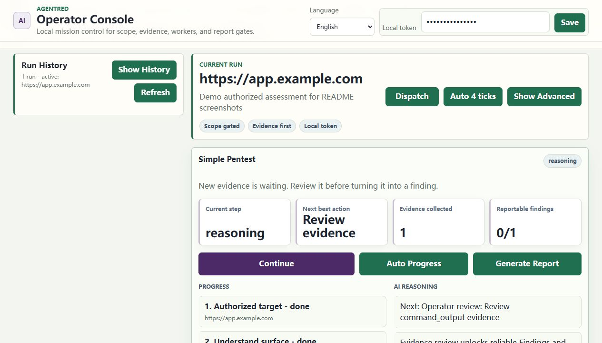
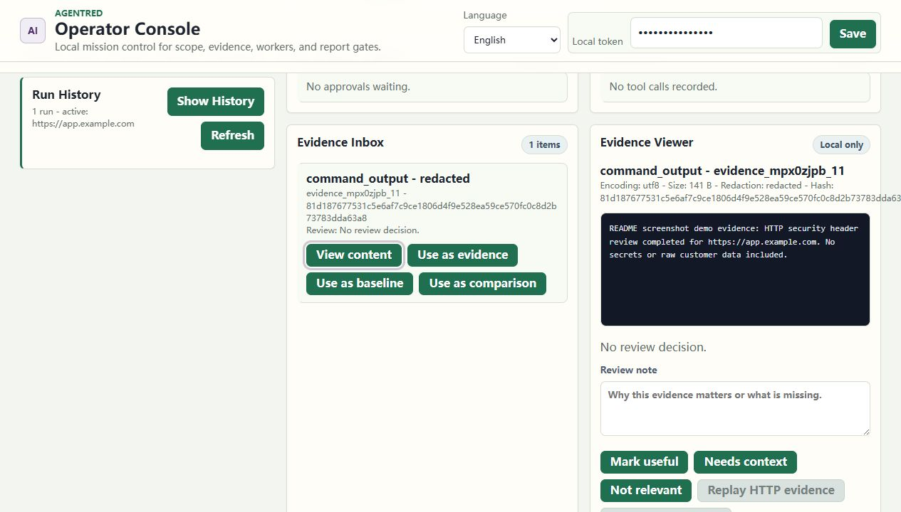
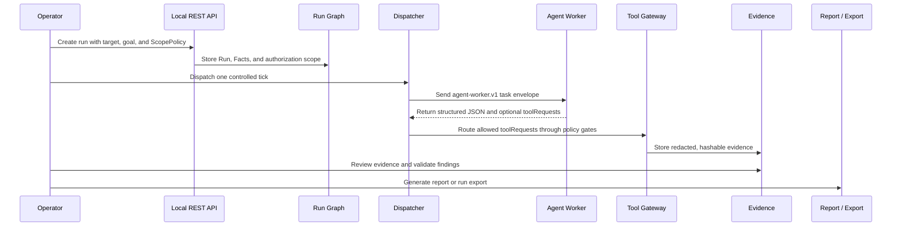
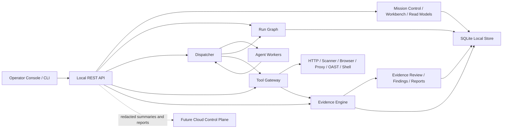

# AgentRed

AI red team workbench for scoped testing and evidence-driven reporting.

[](https://github.com/Coff0xc/AgentRed/actions/workflows/ci.yml)
[](package.json)
[](package.json)
[](LICENSE)
[](SECURITY.md)

AgentRed is a local-first platform kernel for authorized security assessments. It combines a dispatcher-owned state graph, replaceable Agent Workers, a policy-gated Tool Gateway, local evidence storage, operator review, and report/export generation into one auditable workflow.

中文简介: AgentRed 是一个面向授权安全测试的本地优先 AI 红队工作台内核，重点是范围控制、证据留存、人工复核和可交付报告，而不是无约束自动化攻击。

> Use AgentRed only on systems where you have explicit authorization. The platform is designed to fail closed when scope, approval, rate, or evidence requirements are not satisfied.

## At A Glance

| Dimension | AgentRed |
| --- | --- |
| Product shape | Local-first authorized security assessment workbench |
| Runtime | Node.js 24+, TypeScript, ESM |
| Interface | REST API plus local Operator Console at `/app` |
| Storage | SQLite snapshot at `.local/platform.db` by default |
| Worker model | Dispatcher-owned Agent Worker loop with mock and CLI adapters |
| Safety boundary | `ScopePolicy`, R0-R4 risk gates, approval binding, rate limits, redaction |
| Tooling | Governed high-level tools and scanner templates through Tool Gateway |
| Evidence | SHA-256 hashed local artifacts with redaction and review state |
| Outputs | Evidence-backed findings, Markdown reports, hashable run exports |

## Contents

- [At A Glance](#at-a-glance)
- [Screenshots](#screenshots)
- [Why AgentRed Exists](#why-agentred-exists)
- [Current Status](#current-status)
- [Core Concepts](#core-concepts)
- [Quick Start](#quick-start)
- [First Run](#first-run)
- [Operator Workflow](#operator-workflow)
- [Architecture](#architecture)
- [Implemented Capabilities](#implemented-capabilities)
- [Tooling Surface](#tooling-surface)
- [API Overview](#api-overview)
- [Safety Model](#safety-model)
- [Configuration](#configuration)
- [Repository Layout](#repository-layout)
- [Development](#development)
- [Publishing Checklist](#publishing-checklist)
- [Roadmap](#roadmap)
- [Documentation](#documentation)
- [License](#license)

## Screenshots

### Operator Console



### Evidence Review



## Why AgentRed Exists

Most AI security prototypes drift toward broad tool orchestration: many tools, many agents, weak ownership of state, and unclear evidence quality. AgentRed takes the opposite path.

It is built around a small set of product invariants:

- Authorization is a first-class object. Every run carries a `ScopePolicy`.
- Workers are untrusted suggestion producers. They do not write graph state directly.
- The Dispatcher owns protocol state transitions.
- The Tool Gateway is the only path to active tools, browser/proxy captures, OAST, shell commands, and finding proposals.
- Findings must reference same-run evidence.
- Evidence is hashed, redacted, reviewable, and local-first.
- Higher-risk work stops for approval; destructive or out-of-scope actions are blocked.
- Operator-facing read models explain what happened, what is blocked, and what should happen next.

The result is a platform kernel that can host Codex, Claude Code, Gemini, Kimi, mock workers, or private CLI workers while keeping scheduling, evidence, approval, and reporting rules inside the platform.

## Current Status

AgentRed is currently a TypeScript platform kernel with a local REST API and built-in Operator Console.

Implemented today:

- Local API server on `127.0.0.1`
- SQLite-backed local state snapshot
- In-memory test mode
- Dispatcher loop with `bootstrap`, `reason`, and `explore` tasks
- Mock Worker and generic CLI Worker adapter
- Worker protocol envelope preview
- Scope policy evaluation
- Approval service for R3 work
- Tool Gateway with plan and invoke paths
- Built-in bounded web and network scanner templates
- Local evidence engine with SHA-256 hashes and redaction state
- Evidence review, replay planning, and safe GET/HEAD replay
- Evidence-backed findings with candidate, confirmed, and rejected states
- Markdown report generation for HackerOne, Bugcrowd, SRC, and enterprise handoff
- Run export bundles that omit raw local-only evidence by default
- Local Operator Console at `/app`
- Program scope import for Bug Bounty, SRC, enterprise, and generic JSON scope formats
- Browser session, browser snapshot, HAR import, and explicit HTTP proxy capture contracts
- Local OAST callback inbox
- Credential references that reject raw secrets
- Access review and same-run evidence diffing
- SARIF, Android Manifest, Cloud IAM policy, and Identity Graph import services
- Domain Skill registry and curated PoC template registry
- Tool Packs, Toolbox Bundles, Connector Registry, and tool ecosystem readiness views
- Observability, scorecards, worker leaderboard, worker selection preview, capability radar, delivery readiness, mission control, runtime operations, and agent workbench read models
- Focused behavior tests and GitHub CI

Not finished yet:

- Full Tauri + React desktop product
- TLS MITM proxy and local CA lifecycle
- Real browser automation with JavaScript execution
- Docker/Podman external toolbox execution as a default-on feature
- Public OAST DNS/HTTP relay
- Cloud tenant, RBAC, SSO, billing, and cloud sync
- Production-grade relational storage and migrations

External scanners such as nuclei, ffuf, httpx, sqlmap, nmap, tlsx, semgrep, apktool, and Frida are registered as governed templates, but they fail closed unless the required runtime profile and explicit policy gates are enabled.

## Core Concepts

| Concept | Purpose |
| --- | --- |
| `Run` | The authorization container for one assessment objective. |
| `ScopePolicy` | Allowed assets, denied assets, methods, risk posture, credential rules, and rate limits. |
| `Fact` | An objective statement already written to the run graph. |
| `Intent` | A proposed next direction of exploration. Intents can be open, claimed, concluded, or released. |
| `Evidence` | Hashable local artifact metadata with redaction state and local blob content. |
| `Finding` | Candidate or confirmed vulnerability record that must reference evidence. |
| `Dispatcher` | The only component that advances Worker tasks and writes protocol graph transitions. |
| `Agent Worker` | A replaceable model or CLI worker that returns structured JSON for one task. |
| `Tool Gateway` | Policy choke point for HTTP, scanner templates, shell commands, OAST, credentials, access review, and findings. |
| `Approval` | Human decision record required for R3 validation work. |
| `Report` / `RunExport` | Hashable delivery artifacts that preserve evidence references and redaction boundaries. |

State shape:

```text
Run -> Fact -> Intent -> Evidence -> Finding -> Report / Export
```

Worker task loop:

```text
bootstrap -> reason -> explore -> reason -> ... -> completed
```

## Quick Start

### Prerequisites

- Node.js `>=24.0.0`
- npm

### Install and verify

```bash
npm ci
npm run typecheck
npm test
npm run build
```

### Start the local API and console

PowerShell:

```powershell
$env:PLATFORM_API_TOKEN = "local-dev-token"
npm run dev
```

Bash:

```bash
PLATFORM_API_TOKEN=local-dev-token npm run dev
```

Then open:

```text
http://127.0.0.1:4317/app
```

The API stores local state in `.local/platform.db` by default. If `PLATFORM_API_TOKEN` is not set, the server generates a one-time local token and prints it at startup. `/` and `/health` are unauthenticated; API data and mutations require the token.

## First Run

Create a scoped run with the deterministic mock worker:

```bash
curl -X POST http://127.0.0.1:4317/runs \
  -H "Authorization: Bearer $PLATFORM_API_TOKEN" \
  -H "Content-Type: application/json" \
  -d '{
    "target": "https://app.example.com",
    "goal": "Produce an evidence-backed assessment report",
    "scopePolicy": {
      "allowedAssets": ["app.example.com", "*.example.com"],
      "deniedAssets": ["admin.example.com"],
      "allowedMethods": ["GET", "POST"],
      "destructiveAllowed": false,
      "credentialRules": { "allowVaultReferencesOnly": true },
      "rateLimits": { "requestsPerMinute": 120 }
    },
    "workerPool": [
      { "name": "mock-worker", "type": "mock", "maxRunning": 1, "priority": 0, "timeoutMs": 60000 }
    ]
  }'
```

Then use the Operator Console or API to:

1. Inspect `/runs/{id}/mission-control`, `/workbench`, `/search-plan`, and `/surface`.
2. Preview a tool request with `POST /runs/{id}/tools/plan`.
3. Dispatch one Worker step with `POST /runs/{id}/dispatch`.
4. Review evidence with `POST /evidence/{id}/review`.
5. Validate findings with `POST /findings/{id}/validation`.
6. Generate a report with `POST /reports`.
7. Generate a handoff bundle with `POST /runs/{id}/exports`.

The platform deliberately makes progress one auditable step at a time. `POST /runs/{id}/autopilot/tick` and `POST /runs/{id}/search-plan/advance` can automate one safe move, but they still route through Dispatcher, Tool Gateway, approval, evidence, and finding gates.

## Operator Workflow



## Architecture



Key invariant: Agent Workers never claim intents, approve actions, write findings, store evidence, or talk to each other. They return structured task results. The Dispatcher validates those results and decides whether graph state changes.

See [docs/ARCHITECTURE.md](docs/ARCHITECTURE.md) for the full design.

## Implemented Capabilities

| Area | What is available |
| --- | --- |
| Local platform | REST API, local Operator Console, SQLite snapshot store, in-memory test store. |
| Authorization | Scope policy with allowlist, denylist, HTTP method policy, destructive-action flag, credential rules, and rate limits. |
| Worker orchestration | Dispatcher, intent leases, heartbeat support, timeout release, mock worker, CLI worker adapter, worker pool presets. |
| Worker governance | `agent-worker.v1` envelope, envelope preview, output schema validation, tool request mediation, worker runtime health. |
| Planning surfaces | Strategy recommendations, Search Plan, Attack Surface Map, Assessment Flow, Agent Workbench, Mission Control. |
| Tool governance | Tool catalog, no-side-effect plan route, invoke route, approval binding, audit records, scanner template policies. |
| Evidence | Hashing, redaction states, local blob content, content API, evidence review, replay plans, safe replay. |
| Reporting | Evidence-backed findings, validation state, Markdown report generation, run export bundles. |
| Capture | HTTP exchange capture, HAR import, browser snapshots, browser sessions, explicit HTTP proxy absolute-form capture. |
| Domain inputs | SARIF import, Android Manifest import, Cloud IAM policy import, Identity Graph import. |
| Auth context | Credential references with vault/placeholder metadata and raw-secret rejection. |
| Access review | Same-run baseline/comparison evidence review and redacted diff evidence. |
| OAST | Local callback inbox with tokenized callback route and redacted evidence. |
| Skills and templates | Narrow Domain Skills and curated PoC evidence templates. |
| Tool ecosystem | Tool Packs, Toolbox Profiles, Toolbox Bundles, Connector Registry, Ecosystem Coverage, Integration Backlog. |
| Observability | Trace spans, cost ledger, run evaluations, scorecards, capability radar, evidence quality, delivery readiness. |
| CI | GitHub Actions for install, typecheck, test, and build on Node 24. |

## Tooling Surface

High-level tools currently exposed through the Tool Gateway:

- `http.request`
- `browser.navigate`
- `scanner.run_template`
- `shell.run_sandboxed`
- `credential.use_placeholder`
- `access.compare_evidence`
- `oast.start_session`
- `oast.record_callback`
- `finding.propose`

Built-in scanner templates available without external toolbox activation:

- `web.security_headers`
- `web.endpoint_discovery`
- `web.technology_fingerprint`
- `web.cookie_flags`
- `web.link_form_map`
- `web.cors_policy`
- `web.csp_analysis`
- `web.js_asset_inventory`
- `web.cookie_scope_analysis`
- `web.security_txt_policy`
- `web.websocket_discovery_plan`
- `web.sourcemap_exposure_plan`
- `web.redirect_policy`
- `web.cache_policy`
- `web.openapi_discovery`
- `web.oauth_oidc_metadata`
- `web.graphql_introspection_plan`
- `network.dns_records`
- `network.tls_certificate`

Planned or external-gated templates:

- `web.nuclei.safe_templates`
- `web.httpx.fingerprint`
- `web.ffuf.content_discovery`
- `web.sqlmap.verify`
- `network.nmap.safe_top_ports`
- `network.tlsx.bulk_certificate`
- `sast.semgrep.baseline`
- `mobile.apk.manifest`
- `mobile.frida.probe`

External templates require explicit policy. By default they are registered for planning and readiness visibility, not silently executed.

## API Overview

All routes except `GET /`, `GET /health`, the static `/app` shell, and OAST callback delivery require:

```http
Authorization: Bearer <token>
```

or:

```http
X-Platform-Token: <token>
```

Primary route groups:

| Group | Example routes |
| --- | --- |
| Health and console | `GET /`, `GET /health`, `GET /app` |
| Runs and graph | `GET /runs`, `POST /runs`, `GET /runs/{id}/graph`, `GET /runs/{id}/progress` |
| Operator workbenches | `GET /runs/{id}/mission-control`, `/workbench`, `/flow`, `/surface`, `/search-plan` |
| Dispatcher | `POST /runs/{id}/dispatch`, `POST /runs/{id}/autopilot/tick`, `POST /intents/{id}/heartbeat` |
| Workers | `GET /runs/{id}/workers`, `/worker-envelope/preview`, `/worker-selection`, `/worker-evaluation-plan` |
| Tools | `GET /tool-catalog`, `POST /runs/{id}/tools/plan`, `POST /runs/{id}/tools` |
| Tool packs and toolbox | `GET /tool-packs`, `GET /toolbox-policy`, `GET /toolbox-doctor`, `GET /toolbox-profiles` |
| Connectors | `GET /connectors`, `POST /connectors`, `POST /runs/{id}/connectors/{connectorId}/invoke` |
| Evidence and review | `POST /runs/{id}/evidence`, `GET /evidence/{id}/content`, `POST /evidence/{id}/review` |
| Capture | `POST /runs/{id}/captures/http-exchange`, `/captures/har`, `/captures/browser-snapshot` |
| Browser and proxy | `POST /runs/{id}/browser-sessions`, `POST /browser-sessions/{id}/navigate`, `POST /runs/{id}/proxy-sessions` |
| Domain imports | `POST /runs/{id}/sarif-imports`, `/android-manifest-imports`, `/cloud-iam-imports`, `/identity-graph-imports` |
| Findings and reports | `POST /runs/{id}/findings`, `POST /findings/{id}/validation`, `POST /reports`, `POST /runs/{id}/exports` |

Full route details and request/response examples live in [docs/API.md](docs/API.md).

## Safety Model

Risk levels:

| Level | Meaning |
| --- | --- |
| `R0` | Passive read or metadata-only action. |
| `R1` | Ordinary HTTP/browser action, allowed only when in scope. |
| `R2` | Scanning or bounded fuzzing, allowed only when policy and scope match. |
| `R3` | Exploit validation, OAST, state-changing checks, or cross-role auth tests. Requires explicit approval. |
| `R4` | Destructive, credential theft, persistence, data exfiltration, brute force, or out-of-scope behavior. Blocked by default. |

Fail-closed behavior:

- Denylist entries override allowlist entries.
- Out-of-scope targets are blocked before execution or capture storage.
- Unsupported tools and unsupported HTTP methods are blocked.
- R3 actions require approval bound to the same run, tool, target, and risk level.
- R4 actions remain blocked even with approval.
- Tool invocations and approval records store redacted targets and arguments.
- Secret-looking worker environment values are rejected from `workerPool.env`.
- Findings without same-run evidence are rejected.
- Confirmed findings require useful-reviewed evidence.
- Report generation defaults to `confirmed_only`.
- Raw local-only evidence is excluded from reports and exports by default.

Evidence redaction states:

| State | Meaning |
| --- | --- |
| `raw_local_only` | Keep local. Do not upload or include in reports by default. |
| `redacted` | Safe for reports and local indexes. |
| `safe_for_cloud` | Explicitly approved for future cloud sync. |

See [docs/SECURITY_MODEL.md](docs/SECURITY_MODEL.md) for the detailed security model.

## Configuration

| Variable | Default | Purpose |
| --- | --- | --- |
| `PORT` | `4317` | Local API port. |
| `PLATFORM_DB_PATH` | `.local/platform.db` | SQLite state path. |
| `PLATFORM_API_TOKEN` | generated at startup | Local API bearer token. |
| `OPENAI_API_KEY` | unset | Provider key for CLI or future worker integrations. Keep it in the local API process environment. |
| `OPENAI_BASE_URL` | `https://api.openai.com/v1` | Optional OpenAI-compatible base URL. |
| `OPENAI_MODEL` | `gpt-4.1-mini` | Optional default model value for worker integrations. |
| `PLATFORM_ALLOW_EXTERNAL_TOOLBOX` | `0` | Enables external scanner execution only when set to `1`. |
| `PLATFORM_ALLOWED_SCANNER_TEMPLATES` | empty | Comma-separated external template allowlist. `*` allows all registered external templates. |
| `PLATFORM_ENABLE_CONTAINER_TOOLBOX` | `0` | Enables container toolbox profile probing. |
| `PLATFORM_CONTAINER_RUNTIME` | `docker` | Container runtime command. |
| `PLATFORM_WEB_RECON_IMAGE` | `ghcr.io/coff0xc/ai-pentest-toolbox:web-recon` | Planned web recon toolbox image. |
| `PLATFORM_NETWORK_RECON_IMAGE` | `ghcr.io/coff0xc/ai-pentest-toolbox:network-recon` | Planned network recon toolbox image. |
| `PLATFORM_ENABLE_LOCAL_SAST` | `0` | Enables local SAST profile probing. |
| `PLATFORM_ENABLE_ANDROID_TOOLBOX` | `0` | Enables Android toolbox profile probing. |

Do not put API keys, passwords, cookies, JWTs, certificates, HAR files, local databases, browser profiles, or raw evidence exports into Git.

## Repository Layout

```text
.
|-- src/
|   |-- api/                 Local REST API and Operator Console routes
|   |-- domain/              Shared contracts, ids, and risk types
|   |-- graph/               Run graph state service
|   |-- dispatcher/          Worker task scheduling and intent leases
|   |-- workers/             Mock worker, CLI adapter, protocol envelope
|   |-- tools/               Tool Gateway, templates, packs, toolbox readiness
|   |-- captures/            Browser and proxy session services
|   |-- evidence/            Evidence engine and review service
|   |-- findings/            Evidence-backed finding service
|   |-- reports/             Report and run export generation
|   |-- scope/               Scope evaluation and program import
|   |-- strategy/            Strategy and Search Plan read models
|   |-- surface/             Attack Surface Map read model
|   |-- observability/       Scorecards, radar, delivery, eval, leaderboard
|   |-- agents/              Agent Framework, Harness, and Workbench read models
|   |-- desktop/             Local runner and desktop readiness read models
|   |-- skills/              Domain Skill registry and readiness
|   |-- poc/                 Curated PoC evidence templates
|   |-- connectors/          Connector metadata and governed mappings
|   |-- access/              Same-run access review and diff evidence
|   |-- credentials/         Credential reference metadata
|   |-- oast/                Local OAST callback inbox
|   |-- sast/                SARIF import
|   |-- mobile/              Android Manifest import
|   |-- cloud/               Cloud IAM policy import
|   |-- identity/            Identity Graph import
|   |-- storage/             In-memory and SQLite stores
|   `-- index.ts             Local server entrypoint
|-- tests/                   Node test suite
|-- docs/                    Architecture, API, security, publishing notes
|-- .github/workflows/       CI
|-- package.json
|-- tsconfig.json
`-- README.md
```

## Development

Useful commands:

```bash
npm ci
npm run dev
npm run typecheck
npm test
npm run build
```

Package scripts:

| Script | What it does |
| --- | --- |
| `npm run dev` | Runs `src/index.ts` with `tsx`. |
| `npm run typecheck` | Runs TypeScript with `--noEmit`. |
| `npm test` | Runs Node tests through `tsx --test tests/*.test.ts`. |
| `npm run build` | Compiles TypeScript with `tsc -p tsconfig.json`. |

Development rules:

- Keep changes focused and local to the requested behavior.
- Preserve the local-first security model.
- Do not add direct Worker write paths.
- Do not bypass Tool Gateway, scope, approval, audit, evidence, or redaction controls.
- Add focused tests for new security-sensitive behavior.
- Update docs when API routes or operator workflows change.

## Publishing Checklist

Before pushing or making the repository public:

```bash
npm audit
npm run typecheck
npm test
npm run build
```

Never stage:

- `.local/`
- `node_modules/`
- `dist/`
- `.env*`
- `*.db`, `*.sqlite`, `*.sqlite3`
- `*.log`
- `*.har`
- private keys, certificates, browser profiles, or screenshots with private data

The repository already ignores these common local artifacts. See [docs/PUBLISHING.md](docs/PUBLISHING.md) for the full checklist.

## Roadmap

Next product layers:

- Tauri + React desktop UI
- Rust local daemon for desktop runner orchestration
- TLS MITM proxy with local CA management and explicit trust UX
- Real browser controller automation behind the existing session and evidence contracts
- Docker/Podman toolbox execution behind runtime profiles and template allowlists
- OS keychain or 1Password-backed vault bridge
- Public OAST relay with tenant isolation and retention controls
- Cloud control plane for organizations, RBAC, SSO, billing, policy, collaboration, and redacted sync
- Immutable audit ledger and signed report bundles
- Production storage schema with migrations

## Documentation

- [Architecture](docs/ARCHITECTURE.md)
- [API Reference](docs/API.md)
- [Security Model](docs/SECURITY_MODEL.md)
- [Publishing Checklist](docs/PUBLISHING.md)
- [Contributing](CONTRIBUTING.md)
- [Security Policy](SECURITY.md)

## License

MIT. See [LICENSE](LICENSE).
