# AgentRed

**AgentRed 是一个本地优先、证据驱动、带安全门禁的 AI 红队渗透测试智能体平台。**

它的目标不是让大模型自由乱跑工具，而是把企业授权渗透测试拆成一条可审计的工程流水线：

```text
授权范围 -> AI 推理 -> 工具门禁 -> 证据留存 -> 人工复核 -> 漏洞生命周期 -> 报告交付
```

[](https://github.com/Coff0xc/AgentRed/actions/workflows/ci.yml)
[](package.json)
[](package.json)
[](LICENSE)
[](SECURITY.md)

文档入口：
[API](docs/API.md) |
[Architecture](docs/ARCHITECTURE.md) |
[Security Model](docs/SECURITY_MODEL.md) |
[Maturity Roadmap](docs/MATURITY_ROADMAP.md) |
[Enterprise Pentest Workflows](docs/ENTERPRISE_PENTEST_AGENT_WORKFLOWS.md)

> AgentRed 只用于明确授权的安全测试、防御验证和本地证据工作流。
> 未授权目标、凭据窃取、持久化、数据外传、破坏性动作和绕过检测不是这个项目的使用目标。

---

## 1. 一句话讲清楚

AgentRed 是一个“AI 红队项目经理 + 安全工程执行平台”。

大模型负责分析和建议，平台负责控制边界、调用工具、保存证据、审批高风险动作、生成交付材料。

核心原则很简单：

| 谁 | 负责什么 | 不能做什么 |
| --- | --- | --- |
| AI Worker | 分析目标、提出下一步、请求工具、整理结论 | 不能直接执行工具，不能直接写漏洞，不能绕过审批 |
| Dispatcher | 领取任务、推进状态、管理多轮探索、释放卡住的任务 | 不能跳过 Tool Gateway |
| Tool Gateway | 检查 scope、风险等级、审批、速率和工具策略 | 不满足门禁就不执行 |
| Evidence Engine | 保存证据、哈希、脱敏、记录来源 | 不让没有证据的 finding 进入交付 |
| Reviewer | 复核证据、确认或拒绝漏洞 | 高风险验证必须留审批记录 |
| Report / Export | 生成报告和交付包 | 默认不导出 raw local-only 敏感证据 |

---

## 2. 为什么要做这个

成熟企业要的不是“AI 看起来很会黑”，而是这几件事：

1. 能在授权范围内持续推进测试。
2. 能识别高危漏洞信号，而不是只扫 headers。
3. 每一步工具调用都能解释为什么做、做了什么、结果是什么。
4. 每个漏洞都能追到证据。
5. 高风险动作有人审批。
6. 卡住、循环、失败能被监督器发现。
7. 报告能交付，证据能复核，生命周期能跟踪。

AgentRed 现在围绕这些目标建设。

它不是单纯的聊天机器人，也不是把 nmap、nuclei、sqlmap 暴露给大模型的粗糙 MCP 代理。它更像一个本地安全评估内核：AI 可以很强，但必须被工程化约束。

---

## 3. 当前已经具备的能力

| 模块 | 已实现能力 |
| --- | --- |
| 本地平台 | REST API、本地 Operator Console、SQLite 本地存储、测试内存存储 |
| AI Worker | Mock Worker、CLI Worker、Claude Worker、`agent-worker.v1` 协议、session summary 上下文 |
| 调度 | Bootstrap、Reason、Explore 多轮循环、intent lease、heartbeat、超时释放、循环上限监督 |
| 安全门禁 | `ScopePolicy`、allowlist、denylist、HTTP 方法限制、R0-R4 风险等级、审批、速率限制 |
| 主动探测 | `web.param_probe`、认证端点发现、API 版本发现、Host header probe、基础 HTTP 探测 |
| 本地 Runner | `browser.navigate` 默认 fetch controller，可选 Playwright controller，scope 阻断、截图 raw-local-only、DOM/console/network 脱敏入证据 |
| 实时监控 | WebSocket 实时事件推送（延迟 <100ms）、自动降级到轮询、前端客户端自动重连 |
| 外部扫描器 | typed scanner template、nuclei safe template 可用性、nuclei JSONL 自动导入 finding |
| 证据中心 | 本地 evidence blob、SHA-256、脱敏状态、复核状态、evidence content API |
| 访问控制测试 | credential reference、placeholder 使用、跨角色 evidence compare |
| OAST | local OAST、interactsh-compatible callback URL 模式 |
| 漏洞生命周期 | candidate、confirmed、rejected、duplicate、retest readiness、report/export delivery |
| 报告 | Markdown report、run export、confirmed-only 默认交付门禁 |
| 可观测性 | trace、cost ledger、capability radar、enterprise pentest scorer、run supervisor |
| 评测 | 平台测试、scorer、固定场景回归、worker envelope preview |

---

## 4. 当前还不是完整商业产品

这点必须说清楚，避免误用。

AgentRed 当前是平台内核，不是已经完整商品化的 SaaS 或桌面工具。

还在路线图里的能力包括：

- 真正完整的桌面端产品体验
- 桌面端真实浏览器、本地代理、TLS MITM 和证据回放的一体化产品闭环
- TLS MITM proxy 和本地 CA 生命周期
- Docker/Podman 外部 toolbox 默认可用配置
- 更多 typed adapter：nmap、httpx、ffuf、sqlmap、semgrep、Burp、ZAP
- 多租户、RBAC、SSO、审计工作台
- 生产级数据库迁移和团队协作
- 更完整的企业资产导入、任务编排和复测闭环

路线图见：

- [Maturity Roadmap](docs/MATURITY_ROADMAP.md)
- [AI Red Team Agent Reference Analysis](docs/AI_RED_TEAM_AGENT_REFERENCE_ANALYSIS.md)
- [Enterprise Pentest Agent Workflows](docs/ENTERPRISE_PENTEST_AGENT_WORKFLOWS.md)

---

## 5. 快速开始

### 5.1 环境要求

```text
Node.js >= 24.0.0
npm
```

### 5.2 安装

```bash
npm ci
```

### 5.3 验证项目能跑

```bash
npm run typecheck
npm test
npm run build
```

### 5.4 启动本地服务

Linux / macOS：

```bash
PLATFORM_API_TOKEN=local-dev-token npm run dev
```

PowerShell：

```powershell
$env:PLATFORM_API_TOKEN = "local-dev-token"
npm run dev
```

打开本地控制台：

```text
http://127.0.0.1:4317/app
```

注意：

- `PLATFORM_API_TOKEN` 必填。
- 服务不会自己生成 token。
- `/` 和 `/health` 不需要认证。
- 其他 API 需要 `Authorization: Bearer <token>` 或 `X-Platform-Token: <token>`。

### 5.5 可选：启用 Playwright 本地浏览器 Runner

默认安装不强制拉取浏览器二进制。需要 JavaScript/DOM 渲染、截图和浏览器网络事件时，再单独安装并显式开启：

```bash
npm install --no-save playwright
npx playwright install chromium
PLATFORM_API_TOKEN=local-dev-token PLATFORM_ENABLE_PLAYWRIGHT_RUNNER=1 npm run dev
```

PowerShell：

```powershell
npm install --no-save playwright
npx playwright install chromium
$env:PLATFORM_API_TOKEN = "local-dev-token"
$env:PLATFORM_ENABLE_PLAYWRIGHT_RUNNER = "1"
npm run dev
```

启用后，`browser.navigate` 会使用 `playwright_controller`：

- 初始目标、最终 URL 和浏览器发起的子请求仍然走 `ScopePolicy`。
- 越界跳转会被记录为 blocked，不会落截图或页面证据。
- 截图证据是 `raw_local_only`，不会被当作云安全证据。
- DOM 文本、console、network 摘要会脱敏后写入 evidence。
- TLS MITM、本地 CA、视频/trace 生命周期仍属于桌面 Runner 路线图。

---

## 6. 创建第一条授权测试任务

下面这个例子使用 mock worker，适合验证平台流程。

```bash
curl -X POST http://127.0.0.1:4317/runs \
  -H "Authorization: Bearer $PLATFORM_API_TOKEN" \
  -H "Content-Type: application/json" \
  -d '{
    "target": "https://app.example.com",
    "goal": "Produce an evidence-backed assessment report",
    "scopePolicy": {
      "allowedAssets": ["app.example.com", "*.example.com"],
      "deniedAssets": ["admin.example.com"],
      "allowedMethods": ["GET", "POST"],
      "destructiveAllowed": false,
      "credentialRules": { "allowVaultReferencesOnly": true },
      "rateLimits": { "requestsPerMinute": 120 }
    },
    "workerPool": [
      {
        "name": "mock-worker",
        "type": "mock",
        "maxRunning": 1,
        "priority": 0,
        "timeoutMs": 60000
      }
    ]
  }'
```

拿到 `run.id` 后，可以用这些 API 推进：

| 你想做什么 | API |
| --- | --- |
| 查看图状态 | `GET /runs/{id}/graph` |
| 查看任务总览 | `GET /runs/{id}/mission-control` |
| 预览 Worker 输入 | `GET /runs/{id}/worker-envelope/preview` |
| 推进一步 AI 调度 | `POST /runs/{id}/dispatch` |
| 让 Autopilot 推进一步 | `POST /runs/{id}/autopilot/tick` |
| 预览工具门禁 | `POST /runs/{id}/tools/plan` |
| 调用工具 | `POST /runs/{id}/tools` |
| 复核证据 | `POST /evidence/{id}/review` |
| 验证漏洞 | `POST /findings/{id}/validation` |
| 生成报告 | `POST /reports` |
| 导出交付包 | `POST /runs/{id}/exports` |

完整 API 示例见 [docs/API.md](docs/API.md)。

---

## 7. 使用 Claude Worker

AgentRed 已经有内置 Claude Worker 入口。

安装 Anthropic SDK：

```bash
npm install @anthropic-ai/sdk
```

设置环境变量：

```bash
ANTHROPIC_API_KEY=your-key
CLAUDE_MODEL=claude-sonnet-4-5
```

PowerShell：

```powershell
$env:ANTHROPIC_API_KEY = "your-key"
$env:CLAUDE_MODEL = "claude-sonnet-4-5"
```

Run 的 `workerPool` 配置：

```json
[
  {
    "name": "claude-op",
    "type": "claude",
    "maxRunning": 1,
    "priority": 1,
    "timeoutMs": 90000
  }
]
```

规则：

- API key 放在本地服务进程环境变量。
- 不要把 key 写进 `workerPool.env`。
- Worker 只返回 JSON 决策。
- 工具调用仍然必须经过 Dispatcher 和 Tool Gateway。

---

## 8. 使用外部扫描器

外部扫描器默认不会直接执行。

要让外部 toolbox 能运行，需要同时满足：

1. 模板在平台注册。
2. 目标在 `ScopePolicy` 授权范围内。
3. 风险等级允许。
4. 需要审批的动作已经审批。
5. 环境变量允许外部 toolbox。
6. 对应 profile 可用。
7. 模板在 allowlist 中。

常用环境变量：

| 变量 | 说明 |
| --- | --- |
| `PLATFORM_ALLOW_EXTERNAL_TOOLBOX=1` | 允许外部 scanner 执行 |
| `PLATFORM_ALLOWED_SCANNER_TEMPLATES=web.nuclei.safe_templates` | 允许指定模板 |
| `PLATFORM_ALLOWED_SCANNER_TEMPLATES=*` | 允许全部已注册外部模板 |
| `PLATFORM_ENABLE_CONTAINER_TOOLBOX=1` | 启用 container toolbox profile |
| `PLATFORM_CONTAINER_RUNTIME=docker` | 使用 Docker |

示例：

```bash
PLATFORM_API_TOKEN=local-dev-token \
PLATFORM_ALLOW_EXTERNAL_TOOLBOX=1 \
PLATFORM_ALLOWED_SCANNER_TEMPLATES=web.nuclei.safe_templates \
PLATFORM_ENABLE_CONTAINER_TOOLBOX=1 \
npm run dev
```

`web.nuclei.safe_templates` 当前是 available adapter。执行产生的 nuclei JSONL 输出会自动尝试导入为结构化 findings。解析失败不会阻断原始 command output evidence 的保存。

---

## 9. 平台工作流

### 9.1 标准流程

```mermaid
flowchart LR
  A["Create Run"] --> B["ScopePolicy"]
  B --> C["Worker Bootstrap"]
  C --> D["Worker Reason"]
  D --> E["Intent"]
  E --> F["Worker Explore"]
  F --> G["Tool Gateway"]
  G --> H["Evidence"]
  H --> I["Review Evidence"]
  I --> J["Finding"]
  J --> K["Validate"]
  K --> L["Report"]
  L --> M["Export"]
```



### 9.2 Worker 循环

```text
bootstrap -> reason -> explore -> reason -> explore -> ... -> complete
```

### 9.3 多轮 Explore

Worker 可以在 explore 结果里返回：

```json
{
  "accepted": true,
  "data": {
    "description": "Need one more round after baseline evidence.",
    "continueExplore": true,
    "toolRequests": []
  }
}
```

平台行为：

- 先执行本轮 `toolRequests`。
- 保存产生的 evidence。
- 下一轮重新读取最新 graph。
- 把 `producedEvidenceIds` 传回 Worker。
- 最多 4 轮。
- 如果 4 轮后 Worker 仍要求继续，Dispatcher 会释放 intent 并记录 blocked reason。

这避免了 AI 在没有新证据的情况下空转，也避免把未完成探索伪装成已完成结论。

---

## 10. 安全模型

### 10.1 风险等级

| 等级 | 含义 | 默认处理 |
| --- | --- | --- |
| `R0` | 元数据、被动读取、内部整理 | 可执行 |
| `R1` | 普通 HTTP 或浏览器动作 | 必须在 scope 内 |
| `R2` | 扫描、有限 fuzzing、主动探测 | 必须在 scope 内，受策略和速率限制 |
| `R3` | exploit validation、OAST、状态变化、跨角色测试 | 必须人工审批 |
| `R4` | 破坏、凭据窃取、持久化、外传、暴力破解、越权 | 默认阻断，break-glass 也需要 token 和审批 |

### 10.2 Fail-closed 规则

AgentRed 宁可阻断，也不默认冒险。

- 目标不在 allowlist：阻断。
- 目标在 denylist：阻断。
- HTTP 方法不允许：阻断。
- 工具未注册：阻断。
- 风险等级超出策略：阻断。
- R3 没审批：阻断并生成 approval request。
- R4 没 break-glass token：阻断。
- Finding 没 evidence：拒绝。
- 报告没有 confirmed finding：拒绝。
- raw local-only evidence 默认不导出。
- 发现疑似 secret 的 Worker env：拒绝。

### 10.3 证据要求

一个可交付漏洞至少应该具备：

1. 受影响资产。
2. 触发条件。
3. 证据 ID。
4. 影响说明。
5. 复现步骤。
6. 修复建议。
7. 验证状态。
8. 复核记录。

没有证据的“感觉像漏洞”不能进入正式报告。

---

## 11. 项目结构

```text
.
|-- src/
|   |-- api/             REST API 和本地控制台
|   |-- dispatcher/      AI Worker 调度、intent lease、多轮 explore
|   |-- workers/         Worker 协议、Mock、CLI、Claude
|   |-- tools/           Tool Gateway、扫描模板、toolbox
|   |-- graph/           Run Graph 状态
|   |-- evidence/        证据保存、哈希、内容读取
|   |-- findings/        Finding 创建和验证
|   |-- reports/         报告和导出
|   |-- scope/           授权范围判断
|   |-- strategy/        策略建议、Autopilot phase gate
|   |-- scanners/        Scanner result import
|   |-- oast/            OAST 会话和 callback 证据
|   |-- credentials/     Credential reference
|   |-- access/          跨角色 evidence compare
|   |-- observability/   监督、评分、雷达、成本和质量指标
|   |-- storage/         内存和 SQLite 存储
|   `-- index.ts         服务入口
|-- tests/               平台回归测试
|-- docs/                架构、API、安全模型、路线图
|-- package.json
|-- tsconfig.json
`-- README.md
```

---

## 12. 常用命令

| 命令 | 作用 |
| --- | --- |
| `npm ci` | 安装依赖 |
| `npm run dev` | 启动本地 API |
| `npm run typecheck` | TypeScript 类型检查 |
| `npm test` | 运行全部测试 |
| `npm run build` | 编译到 `dist/` |

---

## 13. 开发规则

如果你要改这个项目，请守住这些线：

1. 不让 Worker 直接执行工具。
2. 不让 Worker 直接写 evidence、finding、approval、report。
3. 不绕过 ScopePolicy。
4. 不绕过 Tool Gateway。
5. 不把 secret 写进代码、日志、测试 fixture 或 README。
6. 安全敏感逻辑必须有测试。
7. 任何外部 scanner 都必须 typed adapter、allowlist、profile readiness、scope gate。
8. 高风险动作必须能被审计和复核。

---

## 14. 适合谁用

适合：

- 企业安全团队
- 授权渗透测试团队
- 红队平台研发
- AppSec / DevSecOps 工程团队
- 想把 AI 引入安全评估但不想失控的团队

不适合：

- 未授权测试
- 偷凭据
- 打生产破坏性 payload
- 做持久化
- 绕过检测
- 数据外传
- 把大模型当无限制攻击工具

---

## 15. 交付物是什么

AgentRed 最终要交付的不是“AI 说发现了漏洞”，而是：

```text
Finding + Evidence + Review + Validation + Report + Export
```

也就是：

- 这个漏洞是什么。
- 影响哪个资产。
- 为什么是漏洞。
- 哪些证据支持它。
- 谁复核过证据。
- 风险等级是多少。
- 如何复现。
- 如何修复。
- 是否已经进入报告。
- 是否可以交付给客户或内部团队。

这才是企业能用的红队智能体。

---

## 16. English Summary

AgentRed is a local-first AI red team workbench for authorized, evidence-driven security assessments.

It does not give the model direct control over tools or state. AI Workers propose structured actions. The Dispatcher advances the run graph. The Tool Gateway enforces scope, risk, approval, rate, and evidence gates. Evidence is stored locally, hashed, redacted, reviewed, and then tied to findings, reports, and exports.

Quick start:

```bash
npm ci
npm run typecheck
npm test
npm run build
PLATFORM_API_TOKEN=local-dev-token npm run dev
```

Open:

```text
http://127.0.0.1:4317/app
```

Read more:

- [API](docs/API.md)
- [Architecture](docs/ARCHITECTURE.md)
- [Security Model](docs/SECURITY_MODEL.md)
- [Maturity Roadmap](docs/MATURITY_ROADMAP.md)
- [Enterprise Pentest Agent Workflows](docs/ENTERPRISE_PENTEST_AGENT_WORKFLOWS.md)

---

## 17. License

MIT. See [LICENSE](LICENSE).
