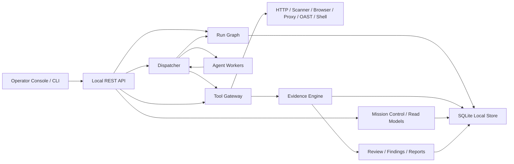

# AgentRed

<div align="center">

**Local-first AI red team workbench for scoped, evidence-driven security assessments.**

**面向授权范围、证据留存和可交付报告的本地优先 AI 红队工作台。**

[](https://github.com/Coff0xc/AgentRed/actions/workflows/ci.yml)
[](package.json)
[](package.json)
[](LICENSE)
[](SECURITY.md)

[English](#english) | [中文](#中文) | [API](docs/API.md) | [Architecture](docs/ARCHITECTURE.md) | [Security Model](docs/SECURITY_MODEL.md)

</div>

> [!IMPORTANT]
> AgentRed is built for authorized security work only. It fails closed when scope, approval, rate, or evidence requirements are not satisfied.
>
> AgentRed 仅用于已获得明确授权的安全测试。当范围、审批、速率或证据要求不满足时，平台默认阻断。

<table>
  <tr>
    <td width="50%">
      
    </td>
    <td width="50%">
      
    </td>
  </tr>
  <tr>
    <td><strong>Operator Console / 操作台</strong><br>Run progress, next action, evidence count, and report gates in one local view.<br>集中展示运行进度、下一步动作、证据数量和报告门禁。</td>
    <td><strong>Evidence Review / 证据复核</strong><br>Redacted local evidence, review decisions, and finding handoff controls.<br>本地脱敏证据、复核决策和 Finding 交付控制。</td>
  </tr>
</table>

## English

AgentRed is a TypeScript platform kernel for running AI-assisted security assessments without giving agents direct authority over tools, findings, or evidence. It combines a dispatcher-owned state graph, replaceable Agent Workers, a policy-gated Tool Gateway, local evidence storage, human review, and report/export generation into one auditable workflow.

Most AI security prototypes optimize for broad orchestration: more tools, more agents, more autonomous action. AgentRed optimizes for control. Workers suggest. The Dispatcher decides. The Tool Gateway gates. Evidence is hashed, redacted, and reviewed before it becomes a finding or report artifact.

### Why AgentRed

| Problem | AgentRed's answer |
| --- | --- |
| AI agents can overreach scope | Every run carries a `ScopePolicy`; out-of-scope actions fail before execution or capture. |
| Tool output is hard to trust | Evidence is stored locally, hashed with SHA-256, redacted, and reviewable. |
| Findings often lack proof | Findings must reference same-run evidence; confirmed findings require useful-reviewed evidence. |
| Multi-agent systems blur ownership | Workers never write protocol state. The Dispatcher owns graph transitions. |
| External scanners can be risky | Scanner templates are registered, planned, gated, and fail closed unless runtime policy allows them. |
| Reports need commercial handoff discipline | Reports and exports preserve evidence references while excluding raw local-only content by default. |

### Product Shape

| Dimension | Current implementation |
| --- | --- |
| Runtime | Node.js 24+, TypeScript, ESM |
| Interface | Local REST API plus Operator Console at `/app` |
| Storage | SQLite snapshot at `.local/platform.db` by default; in-memory mode for tests |
| Worker model | Dispatcher-owned loop with mock and CLI Agent Worker adapters |
| Safety model | `ScopePolicy`, R0-R4 risk gates, approvals, rate limits, redaction |
| Evidence model | Local blobs, SHA-256 hashes, review state, redaction state |
| Outputs | Evidence-backed findings, Markdown reports, hashable run exports |

### Quick Start

Prerequisites:

- Node.js `>=24.0.0`
- npm

Install and verify:

```bash
npm ci
npm run typecheck
npm test
npm run build
```

Start the local API and Operator Console:

```bash
PLATFORM_API_TOKEN=local-dev-token npm run dev
```

PowerShell:

```powershell
$env:PLATFORM_API_TOKEN = "local-dev-token"
npm run dev
```

Open:

```text
http://127.0.0.1:4317/app
```

`PLATFORM_API_TOKEN` is required and must be generated outside the process; the server refuses to start without it and never prints the token value. `/` and `/health` are unauthenticated; API data and mutations require `Authorization: Bearer <token>` or `X-Platform-Token: <token>`.

### First Scoped Run

Create a run with a deterministic mock worker:

```bash
curl -X POST http://127.0.0.1:4317/runs \
  -H "Authorization: Bearer $PLATFORM_API_TOKEN" \
  -H "Content-Type: application/json" \
  -d '{
    "target": "https://app.example.com",
    "goal": "Produce an evidence-backed assessment report",
    "scopePolicy": {
      "allowedAssets": ["app.example.com", "*.example.com"],
      "deniedAssets": ["admin.example.com"],
      "allowedMethods": ["GET", "POST"],
      "destructiveAllowed": false,
      "credentialRules": { "allowVaultReferencesOnly": true },
      "rateLimits": { "requestsPerMinute": 120 }
    },
    "workerPool": [
      { "name": "mock-worker", "type": "mock", "maxRunning": 1, "priority": 0, "timeoutMs": 60000 }
    ]
  }'
```

Then drive the run through the console or API:

1. Inspect mission state with `/runs/{id}/mission-control`, `/workbench`, `/search-plan`, and `/surface`.
2. Preview tool gates with `POST /runs/{id}/tools/plan`.
3. Dispatch one Agent Worker step with `POST /runs/{id}/dispatch`.
4. Review evidence with `POST /evidence/{id}/review`.
5. Validate findings with `POST /findings/{id}/validation`.
6. Generate a report with `POST /reports`.
7. Generate a handoff bundle with `POST /runs/{id}/exports`.

Autonomous progress is intentionally incremental. `POST /runs/{id}/autopilot/tick` and `POST /runs/{id}/search-plan/advance` automate one safe move at a time, while still routing through Dispatcher, Tool Gateway, approval, evidence, and finding gates.

### How It Works



Core invariant: Agent Workers never claim intents, approve actions, write findings, store evidence, or communicate with each other. They return structured task results. The Dispatcher validates those results and decides whether graph state changes.

State shape:

```text
Run -> Fact -> Intent -> Evidence -> Finding -> Report / Export
```

Worker loop:

```text
bootstrap -> reason -> explore -> reason -> ... -> completed
```

### Core Concepts

| Concept | Meaning |
| --- | --- |
| `Run` | Authorization container for one assessment objective. |
| `ScopePolicy` | Allowed assets, denied assets, methods, risk posture, credential rules, and rate limits. |
| `Fact` | Objective state already accepted into the run graph. |
| `Intent` | Proposed direction of exploration. Intents can be open, claimed, concluded, or released. |
| `Evidence` | Hashable local artifact metadata plus local blob content and redaction state. |
| `Finding` | Candidate or confirmed vulnerability record tied to evidence. |
| `Dispatcher` | Component that advances Worker tasks and writes graph transitions. |
| `Agent Worker` | Replaceable model or CLI worker that returns structured JSON for one task. |
| `Tool Gateway` | Policy choke point for tools, scanner templates, shell commands, OAST, credentials, access review, and findings. |
| `Approval` | Human decision record required for R3 validation work. |
| `Report` / `RunExport` | Delivery artifacts that preserve evidence references and redaction boundaries. |

### Implemented Surface

| Area | Available today |
| --- | --- |
| Local platform | REST API, local Operator Console, SQLite snapshot store, in-memory test store. |
| Authorization | Allowlist, denylist, HTTP method policy, destructive-action flag, credential rules, rate limits. |
| Worker orchestration | Dispatcher, intent leases, heartbeat support, timeout release, mock worker, CLI worker adapter. |
| Worker governance | `agent-worker.v1` envelope, envelope preview, output schema validation, runtime health. |
| Planning views | Strategy recommendations, Search Plan, Attack Surface Map, Assessment Flow, Agent Workbench, Mission Control. |
| Tool governance | Tool catalog, no-side-effect plan route, invoke route, approval binding, audit records. |
| Evidence | Hashing, redaction states, local blob content, content API, evidence review, replay plans, safe replay. |
| Reporting | Evidence-backed findings, validation state, Markdown reports, run export bundles. |
| Capture | HTTP exchange capture, HAR import, browser snapshots, browser sessions, explicit HTTP proxy capture. |
| Domain imports | SARIF, Android Manifest, Cloud IAM policy, Identity Graph. |
| Observability | Trace spans, cost ledger, evaluations, scorecards, capability radar, evidence quality, delivery readiness, enterprise pentest scorer, vulnerability lifecycle, run supervisor. |
| Ecosystem | Tool Packs, Toolbox Profiles, Toolbox Bundles, Connector Registry, integration backlog. |
| CI | GitHub Actions for install, typecheck, test, and build on Node 24. |

### Tool Gateway

High-level tools currently exposed through policy gates:

| Tool | Purpose |
| --- | --- |
| `http.request` | Scope-checked HTTP request capture. |
| `browser.navigate` | Browser-session navigation evidence. |
| `scanner.run_template` | Governed scanner template execution or planning. |
| `shell.run_sandboxed` | Restricted shell command execution through an allowlist. |
| `credential.use_placeholder` | Audited placeholder credential use without storing raw secrets. |
| `access.compare_evidence` | Same-run evidence comparison for access review. |
| `oast.start_session` | Local OAST session planning and approval flow. |
| `oast.record_callback` | Redacted OAST callback evidence. |
| `finding.propose` | Evidence-backed candidate finding proposal. |

Built-in scanner templates include web security headers, endpoint discovery, technology fingerprinting, cookie flags, CORS/CSP analysis, JavaScript asset inventory, OpenAPI/OAuth discovery, GraphQL introspection planning, DNS records, and TLS certificate capture.

External templates such as nuclei, ffuf, httpx, sqlmap, nmap, tlsx, semgrep, apktool, and Frida are registered for planning and readiness visibility. They fail closed unless the required runtime profile and explicit policy gates are enabled.

### API Overview

Primary route groups:

| Group | Example routes |
| --- | --- |
| Health and console | `GET /`, `GET /health`, `GET /app` |
| Runs and graph | `GET /runs`, `POST /runs`, `GET /runs/{id}/graph`, `GET /runs/{id}/progress` |
| Operator workbenches | `GET /runs/{id}/mission-control`, `/workbench`, `/flow`, `/surface`, `/search-plan` |
| Dispatcher | `POST /runs/{id}/dispatch`, `POST /runs/{id}/autopilot/tick`, `POST /intents/{id}/heartbeat` |
| Workers | `GET /runs/{id}/workers`, `/worker-envelope/preview`, `/worker-selection`, `/worker-evaluation-plan` |
| Tools | `GET /tool-catalog`, `POST /runs/{id}/tools/plan`, `POST /runs/{id}/tools` |
| Evidence and review | `POST /runs/{id}/evidence`, `GET /evidence/{id}/content`, `POST /evidence/{id}/review` |
| Capture | `POST /runs/{id}/captures/http-exchange`, `/captures/har`, `/captures/browser-snapshot` |
| Findings and reports | `POST /runs/{id}/findings`, `POST /findings/{id}/validation`, `POST /reports`, `POST /runs/{id}/exports` |

Full request and response examples live in [docs/API.md](docs/API.md).

### Safety Model

Risk levels:

| Level | Meaning |
| --- | --- |
| `R0` | Passive read or metadata-only action. |
| `R1` | Ordinary HTTP/browser action, allowed only when in scope. |
| `R2` | Scanning or bounded fuzzing, allowed only when policy and scope match. |
| `R3` | Exploit validation, OAST, state-changing checks, or cross-role auth tests. Requires explicit approval. |
| `R4` | Destructive, credential theft, persistence, data exfiltration, brute force, or out-of-scope behavior. Blocked by default. |

Fail-closed behavior:

- Denylist entries override allowlist entries.
- Out-of-scope targets are blocked before execution or capture storage.
- Unsupported tools and unsupported HTTP methods are blocked.
- R3 actions require approval bound to the same run, tool, target, and risk level.
- R4 actions remain blocked even with approval.
- Tool invocations and approval records store redacted targets and arguments.
- Secret-looking Worker environment values are rejected from `workerPool.env`.
- Findings without same-run evidence are rejected.
- Confirmed findings require useful-reviewed evidence.
- Report generation defaults to `confirmed_only`.
- Raw local-only evidence is excluded from reports and exports by default.

See [docs/SECURITY_MODEL.md](docs/SECURITY_MODEL.md) for the detailed model.

### Configuration

| Variable | Default | Purpose |
| --- | --- | --- |
| `PORT` | `4317` | Local API port. |
| `PLATFORM_DB_PATH` | `.local/platform.db` | SQLite state path. |
| `PLATFORM_API_TOKEN` | required | Local API bearer token. Generate it outside the process and keep it out of logs. |
| `OPENAI_API_KEY` | unset | Provider key for future or CLI Worker integrations; keep it in the API process environment. |
| `OPENAI_BASE_URL` | `https://api.openai.com/v1` | Optional OpenAI-compatible base URL. |
| `OPENAI_MODEL` | `gpt-4.1-mini` | Optional default model value for Worker integrations. |
| `PLATFORM_ALLOW_EXTERNAL_TOOLBOX` | `0` | Enables external scanner execution only when set to `1`. |
| `PLATFORM_ALLOWED_SCANNER_TEMPLATES` | empty | Comma-separated external template allowlist; `*` allows all registered external templates. |
| `PLATFORM_ENABLE_CONTAINER_TOOLBOX` | `0` | Enables container toolbox profile probing. |
| `PLATFORM_CONTAINER_RUNTIME` | `docker` | Container runtime command. |
| `PLATFORM_ENABLE_LOCAL_SAST` | `0` | Enables local SAST profile probing. |
| `PLATFORM_ENABLE_ANDROID_TOOLBOX` | `0` | Enables Android toolbox profile probing. |

Do not commit API keys, passwords, cookies, JWTs, certificates, HAR files, local databases, browser profiles, or raw evidence exports.

### Repository Layout

```text
.
|-- src/
|   |-- api/                 Local REST API and Operator Console routes
|   |-- domain/              Shared contracts, ids, and risk types
|   |-- graph/               Run graph state service
|   |-- dispatcher/          Worker task scheduling and intent leases
|   |-- workers/             Mock worker, CLI adapter, protocol envelope
|   |-- tools/               Tool Gateway, templates, packs, toolbox readiness
|   |-- captures/            Browser and proxy session services
|   |-- evidence/            Evidence engine and review service
|   |-- findings/            Evidence-backed finding service
|   |-- reports/             Report and run export generation
|   |-- scope/               Scope evaluation and program import
|   |-- strategy/            Strategy and Search Plan read models
|   |-- surface/             Attack Surface Map read model
|   |-- observability/       Scorecards, radar, delivery, eval, leaderboard
|   |-- agents/              Agent Framework, Harness, and Workbench read models
|   |-- desktop/             Local runner and desktop readiness read models
|   |-- skills/              Domain Skill registry and readiness
|   |-- poc/                 Curated PoC evidence templates
|   |-- connectors/          Connector metadata and governed mappings
|   |-- access/              Same-run access review and diff evidence
|   |-- credentials/         Credential reference metadata
|   |-- oast/                Local OAST callback inbox
|   |-- sast/                SARIF import
|   |-- mobile/              Android Manifest import
|   |-- cloud/               Cloud IAM policy import
|   |-- identity/            Identity Graph import
|   |-- storage/             In-memory and SQLite stores
|   `-- index.ts             Local server entrypoint
|-- tests/                   Node test suite
|-- docs/                    Architecture, API, security, publishing notes, screenshots
|-- .github/workflows/       CI
|-- package.json
|-- tsconfig.json
`-- README.md
```

### Development

Useful commands:

```bash
npm ci
npm run dev
npm run typecheck
npm test
npm run build
```

Package scripts:

| Script | What it does |
| --- | --- |
| `npm run dev` | Runs `src/index.ts` with `tsx`. |
| `npm run typecheck` | Runs TypeScript with `--noEmit`. |
| `npm test` | Runs Node tests through `tsx --test tests/*.test.ts`. |
| `npm run build` | Compiles TypeScript with `tsc -p tsconfig.json`. |

Development rules:

- Preserve the local-first security model.
- Do not add direct Worker write paths.
- Do not bypass Tool Gateway, scope, approval, audit, evidence, or redaction controls.
- Add focused tests for security-sensitive behavior.
- Update docs when API routes or operator workflows change.

### Current Limits

AgentRed is currently a platform kernel, not a finished hosted product. The following are still roadmap items:

- Tauri + React desktop product
- Rust local daemon for desktop runner orchestration
- TLS MITM proxy with local CA management
- Real browser automation with JavaScript execution
- Default-on Docker/Podman external toolbox execution
- Public OAST DNS/HTTP relay
- Cloud tenant, RBAC, SSO, billing, and redacted sync
- Production-grade relational storage and migrations

The maturity path is tracked in [Maturity Roadmap](docs/MATURITY_ROADMAP.md), with a deeper [AI Red Team Agent Reference Analysis](docs/AI_RED_TEAM_AGENT_REFERENCE_ANALYSIS.md) for high-star autonomous pentest agents, LLM red-team frameworks, MCP tool ecosystems, and mature AgentOps patterns. The enterprise high-risk workflow target is captured in [Enterprise Pentest Agent Workflows](docs/ENTERPRISE_PENTEST_AGENT_WORKFLOWS.md), including the Z3r0-inspired multi-agent workbench, real browser/proxy runner, typed scanner adapters, scorers, evidence center, and vulnerability lifecycle. These references are mapped into first-party AgentRed APIs, evidence contracts, parsers, and roadmap gates.

### Documentation

- [Architecture](docs/ARCHITECTURE.md)
- [API Reference](docs/API.md)
- [Security Model](docs/SECURITY_MODEL.md)
- [Maturity Roadmap](docs/MATURITY_ROADMAP.md)
- [AI Red Team Agent Reference Analysis](docs/AI_RED_TEAM_AGENT_REFERENCE_ANALYSIS.md)
- [Enterprise Pentest Agent Workflows](docs/ENTERPRISE_PENTEST_AGENT_WORKFLOWS.md)
- [Publishing Checklist](docs/PUBLISHING.md)
- [Contributing](CONTRIBUTING.md)
- [Security Policy](SECURITY.md)

### License

MIT. See [LICENSE](LICENSE).

---

## 中文

AgentRed 是一个 TypeScript 平台内核，用来运行 AI 辅助的授权安全评估，同时避免让 Agent 直接掌控工具、证据、发现项或报告。它把 Dispatcher 管理的状态图、可替换的 Agent Worker、策略门控的 Tool Gateway、本地证据存储、人工复核和报告导出串成一条可审计的工作流。

很多 AI 安全原型追求“更多工具、更多 Agent、更强自治”。AgentRed 追求的是可控：Worker 负责提出建议，Dispatcher 负责状态推进，Tool Gateway 负责执行门禁，证据必须先本地留存、哈希、脱敏和复核，之后才能进入发现项或报告。

### 为什么需要 AgentRed

| 问题 | AgentRed 的处理方式 |
| --- | --- |
| AI Agent 容易越过授权范围 | 每个 Run 都携带 `ScopePolicy`；越权动作在执行或采集前直接阻断。 |
| 工具输出难以复核 | 证据本地保存，使用 SHA-256 哈希，带脱敏状态和复核状态。 |
| 漏洞发现经常缺少证据 | Finding 必须引用同一个 Run 内的 Evidence；确认项必须绑定已复核证据。 |
| 多 Agent 系统容易状态归属混乱 | Worker 不写协议状态；Dispatcher 统一负责状态迁移。 |
| 外部扫描器风险不可控 | 扫描模板先注册、可预览、受策略门控；运行时策略不满足就默认阻断。 |
| 商业交付需要证据边界 | 报告和导出包保留证据引用，默认排除 raw local-only 内容。 |

### 产品形态

| 维度 | 当前实现 |
| --- | --- |
| 运行时 | Node.js 24+、TypeScript、ESM |
| 界面 | 本地 REST API，加 `/app` Operator Console |
| 存储 | 默认 SQLite 快照 `.local/platform.db`；测试支持内存模式 |
| Worker 模型 | Dispatcher 管理的任务循环，支持 mock 和 CLI Worker 适配器 |
| 安全模型 | `ScopePolicy`、R0-R4 风险等级、审批、速率限制、脱敏 |
| 证据模型 | 本地 blob、SHA-256 哈希、复核状态、脱敏状态 |
| 输出 | 证据支撑的 Findings、Markdown 报告、可哈希的 Run Export |

### 快速开始

前置要求：

- Node.js `>=24.0.0`
- npm

安装并验证：

```bash
npm ci
npm run typecheck
npm test
npm run build
```

启动本地 API 和 Operator Console：

```bash
PLATFORM_API_TOKEN=local-dev-token npm run dev
```

PowerShell：

```powershell
$env:PLATFORM_API_TOKEN = "local-dev-token"
npm run dev
```

打开：

```text
http://127.0.0.1:4317/app
```

`PLATFORM_API_TOKEN` 是必填项，必须在进程外生成；服务缺失该变量会拒绝启动，并且不会打印 token 明文。`/` 和 `/health` 不需要认证；API 数据和写操作需要 `Authorization: Bearer <token>` 或 `X-Platform-Token: <token>`。

### 第一次授权运行

使用确定性的 mock worker 创建一个带范围控制的 Run：

```bash
curl -X POST http://127.0.0.1:4317/runs \
  -H "Authorization: Bearer $PLATFORM_API_TOKEN" \
  -H "Content-Type: application/json" \
  -d '{
    "target": "https://app.example.com",
    "goal": "Produce an evidence-backed assessment report",
    "scopePolicy": {
      "allowedAssets": ["app.example.com", "*.example.com"],
      "deniedAssets": ["admin.example.com"],
      "allowedMethods": ["GET", "POST"],
      "destructiveAllowed": false,
      "credentialRules": { "allowVaultReferencesOnly": true },
      "rateLimits": { "requestsPerMinute": 120 }
    },
    "workerPool": [
      { "name": "mock-worker", "type": "mock", "maxRunning": 1, "priority": 0, "timeoutMs": 60000 }
    ]
  }'
```

之后可以通过界面或 API 推进：

1. 用 `/runs/{id}/mission-control`、`/workbench`、`/search-plan`、`/surface` 查看任务状态。
2. 用 `POST /runs/{id}/tools/plan` 预览工具门禁。
3. 用 `POST /runs/{id}/dispatch` 推进一个 Agent Worker 步骤。
4. 用 `POST /evidence/{id}/review` 复核证据。
5. 用 `POST /findings/{id}/validation` 验证发现项。
6. 用 `POST /reports` 生成报告。
7. 用 `POST /runs/{id}/exports` 生成交付包。

AgentRed 的自治推进是刻意分步的。`POST /runs/{id}/autopilot/tick` 和 `POST /runs/{id}/search-plan/advance` 每次只自动推进一个安全动作，并且仍然经过 Dispatcher、Tool Gateway、审批、证据和 Finding 门禁。

### 工作机制


核心不变量：Agent Worker 不 claim intent、不审批动作、不写 finding、不保存 evidence，也不相互通信。Worker 只返回结构化任务结果，由 Dispatcher 校验并决定是否写入状态图。

状态形态：

```text
Run -> Fact -> Intent -> Evidence -> Finding -> Report / Export
```

Worker 循环：

```text
bootstrap -> reason -> explore -> reason -> ... -> completed
```

### 核心概念

| 概念 | 含义 |
| --- | --- |
| `Run` | 一个评估目标的授权容器。 |
| `ScopePolicy` | 授权资产、拒绝资产、允许方法、风险策略、凭据规则和速率限制。 |
| `Fact` | 已经被接受进 Run Graph 的客观状态。 |
| `Intent` | 下一步探索方向，可处于 open、claimed、concluded 或 released 状态。 |
| `Evidence` | 可哈希的本地证据元数据、本地内容和脱敏状态。 |
| `Finding` | 候选或确认漏洞记录，必须绑定证据。 |
| `Dispatcher` | 推进 Worker 任务并写入图状态迁移的组件。 |
| `Agent Worker` | 可替换的模型或 CLI Worker，每次任务返回结构化 JSON。 |
| `Tool Gateway` | HTTP、扫描模板、shell、OAST、凭据、访问复核和 Finding 的策略门控点。 |
| `Approval` | R3 验证动作所需的人工审批记录。 |
| `Report` / `RunExport` | 保留证据引用和脱敏边界的交付产物。 |

### 已实现能力

| 领域 | 当前能力 |
| --- | --- |
| 本地平台 | REST API、本地 Operator Console、SQLite 快照存储、测试用内存存储。 |
| 授权控制 | allowlist、denylist、HTTP 方法策略、破坏性动作开关、凭据规则、速率限制。 |
| Worker 编排 | Dispatcher、intent lease、heartbeat、超时释放、mock worker、CLI worker adapter。 |
| Worker 治理 | `agent-worker.v1` envelope、envelope preview、输出 schema 校验、运行时健康状态。 |
| 规划视图 | Strategy recommendations、Search Plan、Attack Surface Map、Assessment Flow、Agent Workbench、Mission Control。 |
| 工具治理 | Tool catalog、无副作用 plan 路由、invoke 路由、审批绑定、审计记录。 |
| 证据 | 哈希、脱敏状态、本地 blob、内容 API、证据复核、replay plan、安全 replay。 |
| 报告 | 证据支撑的 Finding、验证状态、Markdown 报告、Run Export。 |
| 采集 | HTTP exchange capture、HAR import、browser snapshot、browser session、显式 HTTP proxy capture。 |
| 领域导入 | SARIF、Android Manifest、Cloud IAM policy、Identity Graph。 |
| 可观测性 | Trace span、成本账本、评估、scorecard、capability radar、evidence quality、delivery readiness、enterprise pentest scorer、vulnerability lifecycle、run supervisor。 |
| 生态 | Tool Packs、Toolbox Profiles、Toolbox Bundles、Connector Registry、integration backlog。 |
| CI | GitHub Actions 覆盖 install、typecheck、test 和 build。 |

### Tool Gateway

当前暴露的高层工具都经过策略门控：

| 工具 | 用途 |
| --- | --- |
| `http.request` | 范围检查后的 HTTP 请求采集。 |
| `browser.navigate` | 浏览器会话导航证据。 |
| `scanner.run_template` | 受治理的扫描模板计划或执行。 |
| `shell.run_sandboxed` | 通过 allowlist 限制的 shell 命令执行。 |
| `credential.use_placeholder` | 审计化的占位凭据使用，不存 raw secret。 |
| `access.compare_evidence` | 同一 Run 内的访问差异证据复核。 |
| `oast.start_session` | 本地 OAST 会话计划和审批流程。 |
| `oast.record_callback` | 脱敏后的 OAST callback 证据。 |
| `finding.propose` | 基于证据提出候选 Finding。 |

内置扫描模板包括 Web 安全头、端点发现、技术指纹、Cookie flags、CORS/CSP 分析、JavaScript 资产清单、OpenAPI/OAuth 发现、GraphQL introspection plan、DNS records 和 TLS certificate capture。

nuclei、ffuf、httpx、sqlmap、nmap、tlsx、semgrep、apktool、Frida 等外部模板目前用于计划和 readiness 展示。只有当运行时 profile 和显式策略门禁都满足时才允许执行，否则默认阻断。

### API 概览

主要路由组：

| 分组 | 示例路由 |
| --- | --- |
| 健康检查和控制台 | `GET /`, `GET /health`, `GET /app` |
| Run 和图状态 | `GET /runs`, `POST /runs`, `GET /runs/{id}/graph`, `GET /runs/{id}/progress` |
| Operator 工作台 | `GET /runs/{id}/mission-control`, `/workbench`, `/flow`, `/surface`, `/search-plan` |
| Dispatcher | `POST /runs/{id}/dispatch`, `POST /runs/{id}/autopilot/tick`, `POST /intents/{id}/heartbeat` |
| Workers | `GET /runs/{id}/workers`, `/worker-envelope/preview`, `/worker-selection`, `/worker-evaluation-plan` |
| Tools | `GET /tool-catalog`, `POST /runs/{id}/tools/plan`, `POST /runs/{id}/tools` |
| 证据和复核 | `POST /runs/{id}/evidence`, `GET /evidence/{id}/content`, `POST /evidence/{id}/review` |
| 采集 | `POST /runs/{id}/captures/http-exchange`, `/captures/har`, `/captures/browser-snapshot` |
| Findings 和报告 | `POST /runs/{id}/findings`, `POST /findings/{id}/validation`, `POST /reports`, `POST /runs/{id}/exports` |

完整请求和响应示例见 [docs/API.md](docs/API.md)。

### 安全模型

风险等级：

| 等级 | 含义 |
| --- | --- |
| `R0` | 被动读取或仅元数据动作。 |
| `R1` | 普通 HTTP/browser 动作，必须在授权范围内。 |
| `R2` | 扫描或有限 fuzzing，必须满足策略和范围。 |
| `R3` | Exploit validation、OAST、状态变更检查或跨角色认证测试，需要显式审批。 |
| `R4` | 破坏性动作、凭据窃取、持久化、数据外传、暴力破解或越权行为，默认阻断。 |

Fail-closed 行为：

- denylist 覆盖 allowlist。
- 越权目标在执行或采集存储前被阻断。
- 不支持的工具和不允许的 HTTP 方法会被阻断。
- R3 动作需要绑定同一 Run、tool、target 和 risk level 的审批。
- R4 即使有审批也保持阻断。
- 工具调用和审批记录只保存脱敏后的目标和参数。
- `workerPool.env` 中疑似 secret 的值会被拒绝。
- 没有同 Run 证据的 Finding 会被拒绝。
- confirmed Finding 要求绑定 useful-reviewed evidence。
- 报告默认只包含 `confirmed_only`。
- raw local-only evidence 默认不进入报告和导出包。

详细模型见 [docs/SECURITY_MODEL.md](docs/SECURITY_MODEL.md)。

### 配置

| 变量 | 默认值 | 用途 |
| --- | --- | --- |
| `PORT` | `4317` | 本地 API 端口。 |
| `PLATFORM_DB_PATH` | `.local/platform.db` | SQLite 状态路径。 |
| `PLATFORM_API_TOKEN` | 必填 | 本地 API bearer token。必须在进程外生成，并避免进入日志。 |
| `OPENAI_API_KEY` | 未设置 | 未来或 CLI Worker 使用的 provider key；必须保存在 API 进程环境变量里。 |
| `OPENAI_BASE_URL` | `https://api.openai.com/v1` | 可选 OpenAI-compatible base URL。 |
| `OPENAI_MODEL` | `gpt-4.1-mini` | 可选 Worker 默认模型。 |
| `PLATFORM_ALLOW_EXTERNAL_TOOLBOX` | `0` | 只有设置为 `1` 时才允许外部扫描器执行。 |
| `PLATFORM_ALLOWED_SCANNER_TEMPLATES` | 空 | 逗号分隔的外部模板 allowlist；`*` 表示允许所有注册模板。 |
| `PLATFORM_ENABLE_CONTAINER_TOOLBOX` | `0` | 启用 container toolbox profile probing。 |
| `PLATFORM_CONTAINER_RUNTIME` | `docker` | 容器运行时命令。 |
| `PLATFORM_ENABLE_LOCAL_SAST` | `0` | 启用本地 SAST profile probing。 |
| `PLATFORM_ENABLE_ANDROID_TOOLBOX` | `0` | 启用 Android toolbox profile probing。 |

不要把 API key、密码、Cookie、JWT、证书、HAR、本地数据库、浏览器 profile 或 raw evidence export 提交进 Git。

### 仓库结构

```text
.
|-- src/
|   |-- api/                 本地 REST API 和 Operator Console 路由
|   |-- domain/              共享契约、id 和风险类型
|   |-- graph/               Run Graph 状态服务
|   |-- dispatcher/          Worker 调度和 intent lease
|   |-- workers/             Mock worker、CLI adapter、protocol envelope
|   |-- tools/               Tool Gateway、templates、packs、toolbox readiness
|   |-- captures/            Browser 和 proxy session 服务
|   |-- evidence/            Evidence engine 和 review service
|   |-- findings/            证据支撑的 finding service
|   |-- reports/             Report 和 run export 生成
|   |-- scope/               Scope evaluation 和 program import
|   |-- strategy/            Strategy 和 Search Plan read models
|   |-- surface/             Attack Surface Map read model
|   |-- observability/       Scorecards、radar、delivery、eval、leaderboard
|   |-- agents/              Agent Framework、Harness、Workbench read models
|   |-- desktop/             Local runner 和 desktop readiness read models
|   |-- skills/              Domain Skill registry 和 readiness
|   |-- poc/                 Curated PoC evidence templates
|   |-- connectors/          Connector metadata 和 governed mappings
|   |-- access/              同 Run access review 和 diff evidence
|   |-- credentials/         Credential reference metadata
|   |-- oast/                Local OAST callback inbox
|   |-- sast/                SARIF import
|   |-- mobile/              Android Manifest import
|   |-- cloud/               Cloud IAM policy import
|   |-- identity/            Identity Graph import
|   |-- storage/             In-memory 和 SQLite stores
|   `-- index.ts             本地服务入口
|-- tests/                   Node test suite
|-- docs/                    架构、API、安全、发布说明和截图
|-- .github/workflows/       CI
|-- package.json
|-- tsconfig.json
`-- README.md
```

### 开发

常用命令：

```bash
npm ci
npm run dev
npm run typecheck
npm test
npm run build
```

脚本说明：

| 脚本 | 作用 |
| --- | --- |
| `npm run dev` | 使用 `tsx` 运行 `src/index.ts`。 |
| `npm run typecheck` | 执行 TypeScript `--noEmit` 类型检查。 |
| `npm test` | 使用 `tsx --test tests/*.test.ts` 运行 Node 测试。 |
| `npm run build` | 使用 `tsc -p tsconfig.json` 编译 TypeScript。 |

开发规则：

- 保持本地优先安全模型。
- 不增加 Worker 直接写状态的路径。
- 不绕过 Tool Gateway、scope、approval、audit、evidence 或 redaction controls。
- 安全敏感行为需要补 focused tests。
- API 路由或 Operator workflow 变化时同步更新文档。

### 当前限制

AgentRed 目前是平台内核，不是完整托管产品。以下仍在路线图中：

- Tauri + React 桌面产品
- Rust 本地 daemon 和 desktop runner 编排
- TLS MITM proxy 和本地 CA 生命周期
- 带 JavaScript 执行能力的真实浏览器自动化
- 默认开启的 Docker/Podman 外部 toolbox 执行
- Public OAST DNS/HTTP relay
- Cloud tenant、RBAC、SSO、billing 和 redacted sync
- 生产级关系型存储和迁移

成熟化路径记录在 [Maturity Roadmap](docs/MATURITY_ROADMAP.md)，更深入的高星 AI 红队智能体、LLM 红队框架、MCP 工具体系和成熟 AgentOps 对标见 [AI Red Team Agent Reference Analysis](docs/AI_RED_TEAM_AGENT_REFERENCE_ANALYSIS.md)。企业级高危漏洞识别和渗透测试工作流见 [Enterprise Pentest Agent Workflows](docs/ENTERPRISE_PENTEST_AGENT_WORKFLOWS.md)，其中纳入了 Z3r0 式多角色工作台、真实浏览器/代理 Runner、typed scanner adapter、scorer、证据中心和漏洞生命周期。这些参考会被映射成 AgentRed 自己的 API、证据契约、解析器和路线图门禁。

### 文档

- [Architecture](docs/ARCHITECTURE.md)
- [API Reference](docs/API.md)
- [Security Model](docs/SECURITY_MODEL.md)
- [Maturity Roadmap](docs/MATURITY_ROADMAP.md)
- [AI Red Team Agent Reference Analysis](docs/AI_RED_TEAM_AGENT_REFERENCE_ANALYSIS.md)
- [Enterprise Pentest Agent Workflows](docs/ENTERPRISE_PENTEST_AGENT_WORKFLOWS.md)
- [Publishing Checklist](docs/PUBLISHING.md)
- [Contributing](CONTRIBUTING.md)
- [Security Policy](SECURITY.md)

### 许可证

MIT。见 [LICENSE](LICENSE)。
