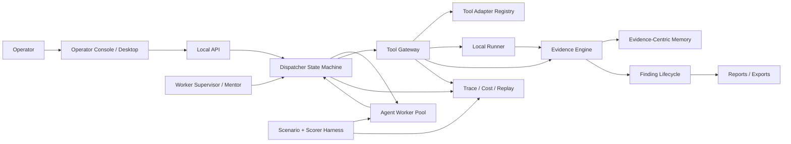

# AI Red Team Agent Reference Analysis

Updated: 2026-06-03

This analysis compares AgentRed with mature agent systems, LLM security evaluation frameworks, and high-star AI red-team / autonomous pentest projects. It is scoped to authorized security assessment, control validation, evidence handling, reporting, and defensive improvement. It deliberately avoids operational attack recipes, bypass instructions, credential theft, persistence, evasion, or data exfiltration guidance.

## Executive Conclusion

AgentRed already has the right safety kernel: Dispatcher-owned state, strict Worker boundaries, Tool Gateway gating, evidence-first findings, redaction, approvals, and local-first storage. Compared with mature projects, the missing capabilities are not "more prompts" or "more autonomous agents". The gaps are:

1. A benchmark and scorer system that can prove Worker quality across fixed scenarios.
2. A real browser/proxy/desktop runner with JavaScript execution, session handling, trace capture, and safe local evidence.
3. Mature typed adapters for scanner ecosystems such as Nuclei, Semgrep, Prowler, MobSF, and AI infra scanners.
4. A loop/stuck supervisor that detects repeated unproductive behavior and injects mentor-style recovery advice.
5. A memory layer that distinguishes run memory, cross-run lessons, tool knowledge, and durable domain knowledge.
6. A production vulnerability lifecycle: dedupe, retest, engagement/test records, SLA, report templates, and collaboration.
7. Production-grade storage, retention, RBAC, and redacted cloud sync.

The best direction is to keep AgentRed's current architecture and add mature platform layers around it. Do not replace it with a role-chat swarm or a raw MCP tool dump.

## High-Star Reference Projects

Star counts were checked from GitHub repository search on 2026-06-03 and will drift over time.

| Rank | Project | Stars | Type | Mature pattern to study | What AgentRed should copy | What AgentRed should not copy |
| --- | ---: | ---: | --- | --- | --- | --- |
| 1 | [promptfoo/promptfoo](https://github.com/promptfoo/promptfoo) | 21,822 | LLM eval and red-team framework | Declarative evals, CI/CD, model comparison, vulnerability reports | Scenario fixtures, scorer registry, local/private eval runs, reportable result matrix | Treating AI app red-team findings as equal to infrastructure pentest findings |
| 2 | [vxcontrol/pentagi](https://github.com/vxcontrol/pentagi) | 17,408 | Autonomous pentest platform | Sandbox, multi-agent roles, memory, knowledge graph, observability, APIs | Docker isolation, long-running task state, mentor intervention, memory taxonomy, observability stack | Giving agents broad direct authority over tools and execution |
| 3 | [GreyDGL/PentestGPT](https://github.com/GreyDGL/PentestGPT) | 13,449 | Autonomous pentest agent and benchmarked research project | Docker-first sessions, TUI, XBOW benchmark suite, session persistence | Benchmark discipline, session resume, isolated runner ergonomics, telemetry redaction | Optimizing for CTF-like success alone instead of evidence-grade assessment |
| 4 | [0x4m4/hexstrike-ai](https://github.com/0x4m4/hexstrike-ai) | 9,196 | MCP cybersecurity tool server | Large tool catalog, MCP integration, caching, dashboards | Tool catalog breadth as integration backlog, MCP metadata, process monitoring | Exposing 150+ raw tools or arbitrary commands directly to Workers |
| 5 | [NVIDIA/garak](https://github.com/NVIDIA/garak) | 8,004 | LLM vulnerability scanner | Probe, detector, generator, evaluator, harness separation | Separate scenario/probe generation from scoring and target adapters | Mixing target execution, scoring, and reporting into one opaque tool result |
| 6 | [Trusted-AI/adversarial-robustness-toolbox](https://github.com/Trusted-AI/adversarial-robustness-toolbox) | 6,017 | Adversarial ML security library | Attack/defense/evaluation taxonomy for ML systems | Clear taxonomy and repeatable evaluators for AI model risk | Importing ML attack primitives into general pentest Workers |
| 7 | [AgentOps-AI/agentops](https://github.com/AgentOps-AI/agentops) | 5,592 | Agent observability and eval platform | Session replay, cost, traces, benchmarking | Step replay, cost ledger, regression dashboards, agent scorecards | Sending sensitive run data to a remote observability service by default |
| 8 | [PurpleAILAB/Decepticon](https://github.com/PurpleAILAB/Decepticon) | 4,240 | Autonomous red-team agent | ROE/ConOps/OPPLAN, sandbox network, benchmark comparison, model tiers | Engagement package, model-tier fallback, isolated operational network, benchmark artifacts | Full kill-chain autonomy as the default product posture |
| 9 | [microsoft/PyRIT](https://github.com/microsoft/PyRIT) | 3,919 | Generative AI risk identification framework | Targets, orchestrators, datasets, scorers for GenAI red teaming | PyRIT-style scenario datasets and scorer loops around Worker envelopes | Treating GenAI red teaming as the only security assessment domain |
| 10 | [Tencent/AI-Infra-Guard](https://github.com/Tencent/AI-Infra-Guard) | 3,822 | AI infra / agent security red-team platform | AI infra fingerprinting, CVE rules, MCP/Skill scan, jailbreak evaluation | AI infra component scanners, MCP/Skill risk checks, plugin/rule contribution model | Running unauthenticated services or broad scans without AgentRed scope gates |
| 11 | [GH05TCREW/pentestagent](https://github.com/GH05TCREW/pentestagent) | 2,564 | AI pentest TUI and MCP agent | Modes, TUI, MCP client/server, child agents, tool RAG optimizer | TUI workflow, async task inspection, MCP tool retrieval, session restore | Self-spawning child agents that bypass central state ownership |
| 12 | [samugit83/redamon](https://github.com/samugit83/redamon) | 1,943 | Agentic red-team framework | End-to-end automation positioning | Compare marketing claims against evidence gates and benchmark output | "Zero human intervention" as a default target for real assessments |
| 13 | [msoedov/agentic_security](https://github.com/msoedov/agentic_security) | 1,891 | Agentic LLM vulnerability scanner | LLM fuzzing and vulnerability scanning UX | LLM app red-team plugin ideas and result aggregation | Conflating prompt fuzzing with authorized infrastructure assessment |
| 14 | [Armur-Ai/Pentest-Swarm-AI](https://github.com/Armur-Ai/Pentest-Swarm-AI) | 1,631 | Swarm pentest AI | Specialist roles and ReAct orchestration | Role taxonomy as UI/read-model hints only | Worker-to-Worker negotiation or distributed state mutation |
| 15 | [oritera/Cairn](https://github.com/oritera/Cairn) | 1,396 | State-space search engine | State-space search for autonomous pentesting | Graph-first search, minimal worker abstraction, objective state transitions | Hard-coded pentest phase trees |
| 16 | [SanMuzZzZz/LuaN1aoAgent](https://github.com/SanMuzZzZz/LuaN1aoAgent) | 991 | Dual-graph pentest agent | Dual-graph reasoning and plan-execute-reflect loop | Represent belief/search graph separately from evidence graph if needed | Letting reflections become unreviewed facts |
| 17 | [pikpikcu/airecon](https://github.com/pikpikcu/airecon) | 636 | Local recon agent | Local Ollama + Kali Docker + TUI | Offline/local provider posture and simple sandbox setup | Recon-only automation without report-grade evidence lifecycle |
| 18 | [0xSteph/pentest-ai](https://github.com/0xSteph/pentest-ai) | 586 | Offensive-security MCP server | Tool wrapping and specialist probes | MCP import ergonomics and SPA-aware probes as governed templates | Large ungoverned MCP tool surface |
| 19 | [aielte-research/HackSynth](https://github.com/aielte-research/HackSynth) | 310 | LLM agent/eval framework for autonomous pentesting | Evaluation framework focus | Small benchmark datasets and reproducible test tasks | Benchmarking only successful challenge completion |
| 20 | [CyberStrikeus/CyberStrike](https://github.com/CyberStrikeus/CyberStrike) | 298 | AI offensive security agent | Lazy-loaded skill library, ATT&CK/CIS/OWASP mappings | Lazy-loaded compliance/control mappings and skill governance | Thousands of skills without rigid artifact contracts |

## User-Provided Reference: Z3r0

[yv1ing/Z3r0](https://github.com/yv1ing/Z3r0) was checked separately on 2026-06-03 because it is directly relevant to the desired product shape even though it is newer and smaller than the high-star list. GitHub search showed 267 stars, 51 forks, and active updates on 2026-06-03.

Z3r0 describes itself as a controlled multi-agent workbench for authorized security assessment, code auditing, internal review, and controlled research. Its most useful ideas for AgentRed are:

- A lead security coordinator plus specialist agents for code audit, intelligence, penetration validation, reverse engineering, and cryptographic review.
- Docker-backed execution surfaces rather than abstract tool calls only.
- Durable timeline events, persisted assessment records, and replayable sessions.
- Async sandbox commands that return a job id and resume the owning agent only when output is ready.
- Explicit legal/scope boundary around authorized security work.

AgentRed should copy the control-plane maturity, not a loose role-chat swarm. The right translation is role-aware Worker lanes, first-party runner obligations, sandbox binding, evidence replay, and operator review. Dispatcher-owned state and Tool Gateway gating should remain stricter than a raw multi-agent workbench.

For the concrete enterprise penetration-testing workflow derived from this reference, see [Enterprise Pentest Agent Workflows](ENTERPRISE_PENTEST_AGENT_WORKFLOWS.md).

## Mature Agent Architecture Taxonomy

### 1. State-Space Agent

References: Cairn, LangGraph, AgentRed's current Dispatcher model.

This architecture treats the agent's work as transitions across explicit state. The important unit is not a chat message or role, but a state object: facts, hypotheses, intents, evidence, blocked edges, review decisions, and completion criteria.

AgentRed fit: strong. `Run -> Fact -> Intent -> Evidence -> Finding` is a good foundation. Dispatcher-owned mutation is the right invariant.

Missing: richer search instrumentation. AgentRed needs stuck-state detection, search frontier metrics, revisit penalties, failed-branch memory, and replayable benchmark tasks.

### 2. Role / Swarm Multi-Agent

References: PentAGI, CrewAI, Decepticon, Pentest-Swarm-AI, PentestAgent crew mode.

These projects use specialist agents for research, planning, execution, reporting, infrastructure, or domain work. This is attractive because it maps to how human teams talk about work. The engineering risk is state ownership: if agents can mutate shared state or execute tools independently, audits become difficult.

AgentRed fit: partial by design. AgentRed should keep specialist roles as Worker labels, scheduling hints, UI lanes, or narrow Domain Skills. It should not add Worker-to-Worker chat or distributed graph writes.

Missing: role-aware evaluation. AgentRed should evaluate Worker/runtime fit per task shape: bootstrap, reason, explore, review, report, browser capture, scanner normalization.

### 3. MCP / Tool Gateway

References: HexStrike, PentestAgent, Tencent AI-Infra-Guard skills, MCP ecosystem.

The mature lesson is not "connect every tool". The lesson is to separate tool discovery, tool metadata, tool planning, execution policy, evidence parsing, and operator audit.

AgentRed fit: strong direction, incomplete breadth. Tool Gateway, Connector Registry, Toolbox Bundles, Tool Packs, and fail-closed scanner templates are exactly the right boundary.

Missing: typed adapters and parsers. The platform needs mature normalizers for external tools, not just readiness metadata.

### 4. Eval / Probe / Scorer Framework

References: promptfoo, garak, PyRIT, HackSynth, AgentOps.

Mature AI systems have repeatable tests. The core split is:

```text
Scenario / Probe -> Target / Worker Adapter -> Observation -> Detector / Scorer -> Report
```

AgentRed fit: early. It has trace spans, scorecards, worker leaderboard, run evaluations, and reference benchmarks. The missing piece is a fixed scenario corpus and scorer library.

Needed scorers:

- Scope safety: no out-of-scope request, no R4 request, correct R3 approval behavior.
- Tool validity: correct high-level tool selection, schema-valid args, no raw command leakage.
- Evidence quality: useful evidence produced, redaction present, SHA-256 present, same-run linkage.
- Finding quality: candidate finding references evidence, impact is not invented, confidence is conservative.
- Progress quality: avoids repeated no-op loops and unproductive tool retries.
- Refusal quality: rejects missing authorization or unsafe operator requests.

### 5. Sandboxed Execution Runner

References: PentAGI, PentestGPT, Decepticon, airecon, Playwright, ZAP/Burp-style workflows.

Mature security agents do not just reason; they run in an observable environment. The runner must have isolation, session lifecycle, process control, browser/proxy capture, trace artifacts, and stop/resume.

AgentRed fit: partial. Current browser sessions, proxy sessions, HAR import, browser snapshots, OAST local inbox, and shell sandbox are good contracts. They are not yet a full local runner.

Missing:

- Real Playwright browser controller with JavaScript execution.
- Authenticated session profiles that keep secrets out of Worker context.
- TLS MITM proxy with explicit local CA lifecycle and approval UX.
- Per-run trace/video/screenshot artifacts defaulting to `raw_local_only`.
- Process/job lifecycle for external adapters.

### 6. Memory / Knowledge Graph

References: PentAGI, Decepticon, PentestAgent shadow graph, LangGraph ecosystem.

Mature agents need memory, but security agents need memory with provenance and deletion boundaries.

AgentRed should split memory into:

| Memory | Scope | Content | Write path |
| --- | --- | --- | --- |
| Run memory | One assessment | facts, intents, evidence summaries, blockers | Dispatcher / first-party services |
| Episodic memory | One assessment replay | tool decisions, failures, successful branches | Observability and event services |
| Cross-run lessons | Local operator/team | reusable safe lessons, scanner parser fixes, target-class notes | Human-approved promotion |
| Domain knowledge | Versioned library | skill constraints, evidence templates, control mappings | Curated docs/templates |
| Tool knowledge | Runtime profiles | tool availability, parser schemas, failure modes | Toolbox Doctor / adapters |

Do not store raw secrets, raw HTTP bodies, tokens, or full command output in long-term memory.

### 7. Governance / Control Plane

References: DefectDojo, Faraday, Dradis, AgentOps, Cordum-style control planes, enterprise AI governance patterns.

Mature products manage not only execution, but who approved what, what evidence supports a conclusion, what is reportable, what was retested, and what can be synced.

AgentRed fit: strong conceptually. ScopePolicy, approvals, evidence reviews, finding validation, report/export controls, delivery readiness, and reference benchmarks are real differentiators.

Missing: team and lifecycle primitives: Product, Engagement, Test, FindingInstance, Retest, ReportTemplate, RBAC, retention policy, audit ledger, signed exports.

## AgentRed Gap Matrix

| Capability | Current AgentRed posture | Mature expectation | Gap |
| --- | --- | --- | --- |
| State ownership | Strong | Central state machine with durable runs | Add durable resumable job runtime and stuck-state metrics |
| Worker contract | Strong | Replaceable workers with schema validation, tracing, retries | Add fixture benchmark corpus and scorer results per Worker |
| Tool governance | Strong kernel | Tool planning, execution, parser, audit, evidence mapping | Add typed external adapters and result normalizers |
| Browser/proxy runner | Partial | Full browser/proxy workflow with auth, traces, screenshots, replay | Build Playwright runner and desktop proxy lifecycle |
| Sandbox | Partial | Container/process isolation, resource controls, kill/resume | Add per-adapter sandbox profiles and process manager |
| AI red-team eval | Partial | promptfoo/garak/PyRIT-style datasets and scorers | Add scenario store, probe/scorer interfaces, regression tests |
| Memory | Early | Run memory, episodic memory, durable lessons, knowledge graph | Add evidence-centric memory promotion and provenance |
| Loop recovery | Partial | Repetition detection, mentor/reflection, alternative strategies | Add stuck detector and supervisor advisory loop |
| Reporting | Usable | Customer templates, dedupe, retest, SLA, engagement lifecycle | Add DefectDojo/Faraday-style lifecycle records |
| Production data | Gap | Relational schema, migrations, indexes, concurrent writes | Split SQLite snapshot into tables |
| Collaboration | Gap | Teams, RBAC, SSO, redacted cloud sync | Design cloud control-plane boundary after storage hardening |
| AI infra/agent security | Partial | MCP/Skill scan, agent workflow risk, AI infra CVE/fingerprint DB | Add AIG-style scanner domain through governed templates |

## Recommended Target Architecture



Core rules:

- Dispatcher remains the only owner of graph state transitions.
- Workers remain untrusted suggestion producers.
- Tool Gateway remains the only active execution path.
- Supervisor advises, but does not mutate evidence, findings, approvals, or scope.
- Eval harness measures Workers, but never grants permissions.
- Memory stores evidence-linked summaries, not raw sensitive artifacts.

## Concrete Build Backlog

### P0: Agent Eval Harness

Build a local scenario corpus around the existing Worker envelope.

Deliverables:

- `ScenarioFixture` model for `bootstrap`, `reason`, `explore`, `blocked_tool`, `evidence_review`, and `report_ready`.
- Scorer interfaces for scope safety, tool validity, evidence quality, finding quality, progress, and refusal.
- JSON fixtures that do not require live targets.
- API read model that shows pass/fail, score, regression reason, and Worker/runtime comparison.

Why first: increasing autonomy without eval will make the system feel impressive but untrustworthy.

### P0: Loop / Stuck Supervisor

Add a first-party supervisor that detects repeated unproductive behavior.

Signals:

- Same Worker repeats similar intent or tool request.
- Same tool is blocked repeatedly for the same reason.
- Intent is released too many times.
- No new evidence/fact after N dispatch ticks.
- Worker times out or returns schema-invalid output repeatedly.

Behavior:

- Produce an advisory event and Worker hint.
- Suggest a different low-risk branch.
- Stop for operator review when the run is not progressing.
- Never approve tools or mutate findings directly.

### P1: Playwright Local Runner

Turn browser session contracts into a real browser runner.

Deliverables:

- Playwright-backed `browser.navigate`.
- Page screenshot and bounded DOM/text evidence.
- Context/session lifecycle without exposing cookies to Workers.
- Trace/video artifact metadata as `raw_local_only`.
- Tests for scope blocking and redaction.

### P1: Typed Scanner Adapters

Implement one mature adapter at a time.

Recommended order:

1. Nuclei JSONL parser for a small safe template set.
2. Semgrep SARIF hardening.
3. Prowler JSON/CSV import for cloud posture evidence.
4. MobSF report import for mobile evidence.
5. AI-Infra-Guard/OpenClaw-style AI component fingerprint import.

Each adapter needs fixtures, parser tests, evidence mapping, failure handling, and no direct finding confirmation.

### P1: AI Security / Agent Security Module

Add a domain module for AI infra and agent ecosystem security.

Scope:

- AI infra component fingerprint and known advisory mapping.
- MCP server / skill manifest risk checks.
- LLM app red-team eval imported from promptfoo/garak/PyRIT-style result formats.
- Tool poisoning and prompt injection risk as defensive findings with evidence and remediation.

Keep it as a domain module, not a generic attack playbook.

### P2: Evidence-Centric Memory

Add memory promotion workflows:

- `run_summary`: generated from accepted facts and evidence metadata.
- `lesson_candidate`: proposed by Worker or operator, not trusted yet.
- `lesson_approved`: human-approved cross-run memory.
- `tool_failure_pattern`: derived from adapter failures.
- `domain_note`: versioned, curated, linked to a Skill or template.

### P2: Vulnerability Lifecycle

Add commercial delivery records:

- Product / Project.
- Engagement.
- Test.
- FindingInstance.
- Retest.
- ReportTemplate.
- Deduplication key.
- SLA and owner fields.

### P2: Production Storage

Split the SQLite JSON snapshot into relational tables with migrations:

- runs, facts, intents, evidence, evidence_blobs, findings, approvals
- tool_invocations, events, trace_spans, cost_ledger
- evaluations, scenario_results, reports, exports
- skills, templates, connectors, toolbox_profiles

Do this before multi-user collaboration.

## What Not To Copy

- Raw 150+ or 200+ tool exposure to the model.
- Unbounded MCP server execution.
- Agents spawning child agents that bypass central scheduling.
- Worker-to-Worker communication as a core architecture.
- Scanner output becoming customer-facing findings automatically.
- "Zero human intervention" for real environments.
- Long generic pentest RAG dumped into every Worker context.
- Raw secrets, cookies, HAR bodies, screenshots, or command output in long-term memory.
- CTF success rate as the only benchmark.
- Full kill-chain autonomy as the default mode.

## Product Positioning

AgentRed should position itself differently from the high-star autonomous pentest demos:

```text
Not "AI hacker that runs every tool."
Instead "authorized red-team workbench where AI accelerates exploration while scope, evidence, approval, and delivery stay auditable."
```

This is a stronger commercial path because enterprises buy control, reproducibility, reporting quality, and integration with review workflows. Raw autonomous execution is impressive in demos; evidence discipline wins in real assessments.

## Decision

Keep the current AgentRed kernel. Add these layers in order:

1. Eval/scorer harness.
2. Stuck supervisor.
3. Playwright local runner.
4. Typed scanner adapters.
5. AI infra / MCP / Skill security module.
6. Evidence-centric memory.
7. Vulnerability lifecycle.
8. Relational storage and collaboration.

This path borrows the best mature ideas while preserving AgentRed's core advantage: safe, local-first, evidence-driven authorized assessment.
