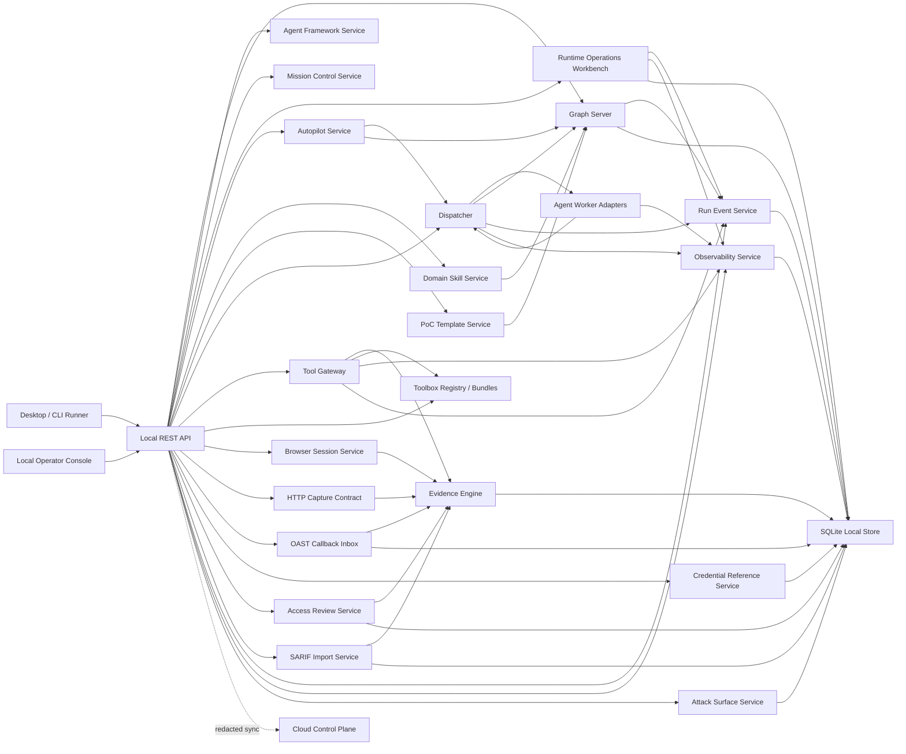

# Architecture

## Product Shape

The platform is local-first. Active testing runs on a local execution node, while a cloud control plane manages organization state, collaboration, billing, policy, reporting, and redacted indexes.



## Core Invariant

Only the dispatcher and first-party services write protocol state.

Agent Workers:

- receive one task
- observe a graph snapshot
- return structured JSON
- never claim intents
- never write facts, findings, evidence, or approvals directly
- never communicate with other workers
- may request high-level tools during `explore`, but only the dispatcher can pass those requests to the Tool Gateway
- may receive enabled Domain Skill context, but skills are narrow domain constraints rather than autonomous sub-agents or playbook stages
- may receive enabled PoC template context, but templates are evidence requirements and safety constraints rather than exploit playbooks or permission grants

This keeps concurrency simple and makes every state transition auditable.

## Graph Model

`Run` is the authorization container.

`ProgramScopeImport` is a pre-run authorization artifact. It hashes the imported Bug Bounty/SRC/enterprise scope JSON, persists only normalized `ScopePolicy` output and counts, and gives operators a reusable way to create runs without copying raw program text into Worker context.

`Fact` is an objective statement already written to the board.

`Intent` is a proposed direction of exploration.

`Hint` is human judgment injected into a run.

`Evidence` is reproducible metadata with hash, redaction state, and a local blob URI. Blob content stays behind the local Evidence Engine instead of being embedded in graph snapshots.

`Finding` is a reportable vulnerability candidate and must reference evidence.

Human review can move a finding between `candidate`, `confirmed`, and `rejected`. Rejected findings remain in the review bundle and event timeline, but report generation filters them out.

`Report` bundles are stored locally as `replay_bundle` evidence so reports remain hashable and reproducible.

`RunExport` is the broader handoff artifact. It packages run graph state, findings, evidence metadata, review decisions, reports, tool audit, sessions, imports, and access-review records into a hashable `replay_bundle` while keeping `raw_local_only` evidence content out of the bundle.

`CredentialReference` is a run-local authenticated context handle. It stores a role, label, allowed-use list, and vault or placeholder reference. It deliberately does not store raw passwords, bearer tokens, JWTs, session cookies, or API keys. Worker envelopes receive only safe metadata and ids.

`AccessReview` is an operator-facing role-diff review record. It links baseline/comparison credentials and evidence, stores a redacted diff evidence artifact, and records whether there are response-level difference signals. It does not turn a difference into a vulnerability without human validation and a Finding.

`OastSession` and `OastCallback` model out-of-band interactions. The current implementation is a local HTTP callback inbox with tokenized URLs; each callback becomes `oast_callback` evidence.

`SarifImport` models local SAST/CI ingestion. It stores the SARIF source label, input hash, normalized result counts, linked evidence id, and any candidate Finding ids created from the import. Static-analysis results remain candidate evidence until a human validates impact.

`AndroidManifestImport` models rigid mobile-domain evidence ingestion. It accepts AndroidManifest.xml text, stores only normalized package, SDK, permission, component, and risk-signal evidence, and can create candidate Findings for exported components, debuggable builds, cleartext traffic, backup exposure, and risk-sensitive permissions. It gives the Android Domain Skill a concrete artifact path without requiring apktool, Frida, a device, or a generic mobile testing playbook.

`CloudIamImport` models rigid cloud-domain artifact ingestion. It accepts IAM policy JSON, stores only normalized statements, counts, and risk signals, and can create candidate Findings for wildcard admin, PassRole, AssumeRole, policy mutation, and broad conditionless allow statements. It gives the Cloud IAM Domain Skill a concrete read-only evidence path without requiring live cloud credentials.

`IdentityGraphImport` models rigid identity-domain artifact ingestion. It accepts BloodHound-style or generic identity graph JSON, stores only normalized node/edge summaries and risk signals, and can create candidate Findings for high-value privilege edges, DCSync-like privileges, Kerberoastable/AS-REP roastable identities, unconstrained delegation, and AdminCount review signals. It gives the AD Identity Path Skill a concrete read-only evidence path without executing lateral movement or credential attacks.

`RunPocTemplateBinding` links a curated PoC/template to a run. The template records vulnerability classes, required evidence kinds, recommended high-level tools, Worker hints, safety notes, references, and tags. It is deliberately not a generic knowledge base: enabling it only adds run-local hints and Worker envelope context.

`RunEvent` is the UI-facing timeline of the run. It records state transitions such as run creation, facts, intents, dispatch ticks, tool decisions, approvals, evidence, findings, and report generation. Event details are redacted and are not a replacement for evidence.

`TraceSpan`, `CostLedgerEntry`, and `RunEvaluation` are the platform-facing observability layer. They are used for model/tool comparison, local runtime cost, quality gates, and later cloud analytics. This layer is separate from the human timeline so UI narration does not become the accounting or eval source of truth.

`RunScorecard` is the product-facing read model on top of that ledger. It compares Worker task outcomes, tool-call outcomes, evidence production, blocked calls, approval pressure, runtime, and the latest evaluation gates. This is the CAI-style comparison layer that lets operators decide which Worker/runtime/tool profile is actually useful instead of only watching raw traces.

`RunCapabilityRadar` is the run-level capability posture over the same state. It scores scope safety, evidence depth, autonomous progress, Worker performance, Tool Gateway usage, rigid domain depth, delivery readiness, and observability into a single operator view. This is the bridge between a clean Cairn-style state graph and commercial platform management: it tells the operator whether the run needs more evidence, better Worker execution, domain-specific Skill/template enablement, toolbox integration, or delivery review. It is read-only and produces scheduling hints; it is not a dispatcher, not a planner that executes tools, and not a replacement for approvals.

`EvidenceQualityIndex` is the commercial evidence-health read model. It joins evidence metadata, local blob integrity, evidence reviews, replay/reproduction signals, redaction state, tool audit links, and Finding evidence references. It answers whether a finding is actually reportable and reproducible without reading raw evidence content, executing replay, validating findings, or changing review state.

`WorkerComparison` extends the scorecard with per-Agent-Worker contribution analysis. It joins configured worker pools, worker trace spans, local cost entries, facts written by each worker, evidence ids attached to those facts, and findings influenced by that evidence. The result is a practical comparison view: success rate, timeout rate, runtime, evidence contribution, finding influence, and an operator recommendation.

`WorkerLeaderboard` lifts that comparison across all local runs. It ranks Worker names and Worker types using trace spans, cost ledger entries, graph facts, evidence contribution, and finding influence. This is the CAI/Apex-style model evaluation layer: it tells the operator which Worker/runtime has actually produced useful evidence and which should be observed or deprioritized. It does not change Dispatcher selection by itself, and Workers cannot write or self-report leaderboard scores.

`WorkerSelectionPolicy` turns leaderboard and current run state into an operator-visible scheduling recommendation. It infers the next task shape, checks Worker runtime readiness, weighs configured priority, current-run outcomes, cross-run success, timeout/error pressure, evidence contribution, finding influence, and task/risk fit, then returns a ranked candidate list. The Dispatcher consumes this ordering when selecting the next Worker and falls back to the original worker-pool order if the policy read model is unavailable. This keeps the platform close to Cairn's simple Dispatcher model while adding CAI/Apex-style eval pressure: the operator can see why a Worker should receive the next task without introducing a multi-agent role tree or Worker-to-Worker negotiation.

`WorkerEvaluationPlan` is the per-run experiment design layer for Agent Workers. It treats `bootstrap`, `reason`, and `explore` as comparable task cells, then reports which Worker/runtime combinations have enough trace, cost, evidence, and finding-influence data to compare. It proposes same-scope low-risk bakeoffs and evidence-quality scoring loops, but it never dispatches Workers or changes Worker selection by itself.

`AttackSurfaceMap` is an operator-facing read model over the same state. It derives visible assets, observed endpoints, technology signals, blockers, and search-frontier items from graph records, evidence metadata, browser/HAR captures, scanner-template summaries, domain imports, access reviews, connector mappings, approvals, and strategy recommendations. It does not introduce a phase tree or sub-agent role; it is a visibility layer for "what do we know and what should be explored next?"

Search Frontier actions are first-party control-plane actions, not Worker powers. `plan` previews the same Tool Gateway decision path used by scanner and strategy previews. `intent` turns a frontier item into a normal Dispatcher-owned intent. `invoke` can run only mapped high-level requests such as `scanner.run_template`, `http.request`, or evidence-backed `finding.propose`, and those requests still pass through normal scope, approval, audit, redaction, and evidence gates.

Built-in scanner templates are the safe bridge toward HexStrike/AutoRedTeam-style tool breadth. The platform currently exposes web baseline, bounded query-parameter probing, client-side browser-policy, modern Web exposure, API/auth metadata, redirect/cache policy, DNS, and TLS metadata templates as first-party `scanner.run_template` actions. External engines such as nuclei, ffuf, httpx, sqlmap, nmap, semgrep, apktool, and Frida remain metadata/profile-backed and fail closed until a governed runtime profile and allowlist are enabled.

## Dispatcher Model

Current implemented task order:

1. `bootstrap`: first worker pass over origin and goal.
2. `reason`: reads the graph and proposes the next intent or completes the run.
3. `explore`: executes exactly one open intent and concludes it into a fact.

Worker choice is policy-aware:

- Dispatcher asks `WorkerSelectionPolicy` for a ranked run pool before each tick.
- Ranking uses health, command configuration, priority, task fit, Worker Leaderboard score, current-run outcomes, evidence contribution, finding influence, and timeout/error pressure.
- If the policy cannot be computed, Dispatcher falls back to the original worker-pool order.
- Worker selection never bypasses output validation, scope, approvals, Tool Gateway, evidence requirements, or intent leases.

Explore dispatch uses intent leases:

- `open` intents are claimed with `claimedBy`, `leaseId`, `heartbeatAt`, and `leaseExpiresAt`.
- expired `claimed` intents are released back to `open` before the next dispatch tick.
- worker rejection, timeout, or missing conclusion moves the intent to `released` with `releaseReason`.
- valid heartbeats extend the lease; stale lease IDs are rejected.

The mock worker demonstrates the contract. Real worker adapters can wrap Claude Code, Codex, Gemini CLI, Kimi CLI, or a custom executable that returns the same JSON shape. A built-in Claude API worker is available for `type: "claude"` when no custom command is configured; it requires `ANTHROPIC_API_KEY`, optional `CLAUDE_MODEL`, and the operator-installed `@anthropic-ai/sdk` package.

The generic CLI adapter:

- spawns commands without a shell by default
- appends an `agent-worker.v1` protocol envelope as the final argument
- kills the process when `timeoutMs` is exceeded
- converts process, timeout, non-JSON, and schema failures into rejected worker results
- accepts only the structured `WorkerTaskResult` shape before the dispatcher mutates graph state
- validates optional `toolRequests` so a Worker can ask for `http.request`, `scanner.run_template`, or another high-level tool without receiving direct execution authority

The Operator Console now exposes Worker Pool configuration during run creation. Presets cover mock, Codex CLI, Claude Code CLI, and mixed Claude+Codex pools; custom JSON is available for Gemini, Kimi, private models, or organization-specific lightweight workers. This keeps Agent Worker as the smallest scheduling unit while making runtime selection visible and operator-controlled.

The protocol envelope contains:

- the task graph and active intent
- the governed high-level tool surface from `GET /tool-catalog`
- safe credential reference metadata for authenticated role context
- enabled PoC template context with evidence requirements and safety notes
- enabled Toolbox Bundle context with governed scanner templates, profile ids, engines, risk levels, and safety notes
- enabled Connector context with safe MCP/CLI/HTTP/container metadata, required environment names, risk levels, and safety notes
- current strategy recommendations for the active run
- hard rules that forbid direct tool execution, direct graph writes, and worker-to-worker coordination
- the JSON output schema
- examples for intent creation, toolRequests, `$produced`, and evidence-backed `finding.propose`

`GET /runs/{id}/worker-envelope/preview` exposes that same envelope as a no-side-effect read model. It follows the Dispatcher's task-selection shape, adds counts and safety flags for the UI, and never healthchecks a CLI, claims an intent, executes a Worker, writes graph state, or embeds raw evidence content. This is the framework-inspection layer: operators can see what Claude Code, Codex, Gemini, Kimi, or a custom Worker would receive before a real dispatch.

During `explore`, a Worker can return:

```json
{
  "accepted": true,
  "data": {
    "description": "Observed login surface and captured baseline response",
    "toolRequests": [
      {
        "tool": "http.request",
        "target": "https://app.example.com/login",
        "method": "GET",
        "riskLevel": "R1",
        "args": {}
      }
    ]
  }
}
```

The dispatcher executes each request through the Tool Gateway. A request that omits `riskLevel` inherits the active intent risk level. Allowed requests can return evidence IDs, and those IDs are attached to the fact created when the intent is concluded. Blocked or approval-required requests release the intent with an audit-visible reason instead of letting the Worker bypass policy.

If a Worker wants to propose a finding from evidence produced earlier in the same `explore` result, it can set `args.evidenceIds` to `["$produced"]` or `args.useProducedEvidence` to `true` on a later `finding.propose` request. The dispatcher expands that placeholder to the evidence IDs returned by earlier allowed tool calls before invoking the Finding Service.

`GET /runs/{id}/workers` exposes worker-pool readiness for desktop and CLI clients:

- worker name and type
- priority and max-running settings
- command configuration state for CLI-backed workers
- healthcheck result and reason

This is intentionally an observability surface. It does not introduce worker-to-worker communication, role ownership, or direct worker graph writes.

## Trace, Cost, And Eval

The platform records trace spans around:

- dispatcher ticks
- Agent Worker executions
- Tool Gateway invocations
- report generation
- run-quality evaluations

The initial cost ledger tracks local runtime and request counts with zero model cost by default. Real Claude Code, Codex, Gemini, Kimi, or private-model adapters can later add token and estimated-price entries while keeping the same `Agent Worker` contract.

`POST /runs/{id}/evaluations` creates a stored quality evaluation for one run. The built-in checks verify scope controls, evidence-backed findings, human review coverage, report redaction safety, and trace availability. This is the first CAI-style framework layer: it makes runs comparable instead of only executable.

## Tool Gateway

The Tool Gateway is the single choke point before security tooling.

It enforces:

- allowed assets
- denied assets
- HTTP method policy
- R3 approval requirements
- R4 default blocking
- run-level requests-per-minute limits
- high-level tool allowlisting
- redacted audit records for allowed, blocked, and approval-required tool requests
- redacted `http_exchange` evidence for allowed `http.request` calls
- redacted `command_output` evidence for allowed `shell.run_sandboxed` calls
- evidence-gated `finding.propose` requests, which create candidate findings through the Finding Service rather than letting Workers write findings directly
- audited `credential.use_placeholder` requests, which record placeholder use as evidence without resolving or storing the underlying secret
- audited `access.compare_evidence` requests, which compare two evidence items and create a redacted diff artifact for authorization review
- governed `oast.start_session` and `oast.record_callback` requests, which keep out-of-band validation behind local audit and evidence capture

`GET /tool-catalog` exposes the governed high-level tool surface to the console and future Agent Worker prompts. It is intentionally a catalog of capabilities and scanner templates, not a raw dump of every executable on disk.

`GET /capabilities` exposes a product-facing capability matrix over the governed tool surface. It groups Web, network, auth, OAST, SAST, mobile, and platform capabilities by available/planned status, high-level tools, scanner templates, profiles, engines, evidence kinds, risk levels, safety controls, and known gaps. This is the operator/business view of HexStrike/AutoRedTeam-style breadth without turning the Worker prompt into a raw exploit catalog.

`GET /agent-framework` exposes the platform as an Agent Worker framework. It is a read-only model of Worker adapters, extension points, state invariants, operator views, and governed surfaces. The purpose is to make extension paths explicit: new models become Worker adapters, external ecosystems become Connector or Toolbox metadata, rigid domains become Domain Skills, and vulnerability-specific guidance becomes PoC templates. It does not dispatch workers, run tools, or grant execution permission.

`GET /runs/{id}/agent-harness` is the run-scoped framework engineering view inspired by rohitg00/ai-engineering-from-scratch. It scores the platform across agent loop contract, tool registry/schema gates, sandbox runner, observation budget, eval harness, workbench handoff, and evidence delivery. It also embeds the no-side-effect Harness Eval Plan: concrete fixture tasks, acceptance criteria, safety gates, and expected artifacts for repeatable Agent Worker evaluation. This makes "AI pentest platform as an agent framework" inspectable without introducing another dispatcher: the Harness is read-only, and active work still routes through Dispatcher, Tool Gateway, evidence review, and finding validation.

`GET /runs/{id}/agent-harness/plan` returns only that fixture plan. The copied ideas are the reusable artifact mindset, explicit agent loop contracts, tool registry/schema validation, sandbox fail-closed checks, fixture-based eval, workbench handoff, and observability. The platform deliberately does not copy generic AI curriculum material, role-tree multi-agent/swarm structures, or bulk prompt/skill dumps into Worker context.

`GET /toolbox-policy` exposes the local external-tool execution policy: whether external execution is enabled, which profile probes are enabled, and which external scanner templates are allowlisted. External execution requires both the global `PLATFORM_ALLOW_EXTERNAL_TOOLBOX=1` gate and `PLATFORM_ALLOWED_SCANNER_TEMPLATES` membership. This keeps a large tool ecosystem from becoming a blanket execution grant.

`GET /toolbox-doctor` is the operational readiness view over Toolbox Runner and scanner template policy. It groups templates by engine, reports ready/partial/policy-blocked/profile-blocked/planned adapter status, summarizes runnable templates, and gives operator actions. It deliberately remains diagnostic: no commands are executed, no images are pulled, no allowlist is changed, and no Worker receives new powers.

`GET /runs/{id}/runtime-activation-plan` is the action-planning layer above Toolbox Doctor. It turns policy blockers, profile blockers, missing template allowlists, bundle context, validation, and safety invariants into a governed activation order. This is how HexStrike/AutoRedTeam-style tool breadth becomes commercial runner setup: an operator can see which environment gates, runtime profiles, and template ids are required, but the plan itself cannot mutate policy or execute tools.

`GET /runs/{id}/execution-node` is the local-first execution node view that a future Tauri/Rust desktop runner can own. It joins Worker runtime health, Toolbox profiles, Toolbox Doctor status, browser/proxy/OAST sessions, enabled Bundle/Connector context, and fail-closed external execution policy into one run-scoped readiness report. This addresses the WonderSuite/AutoRedTeam execution-environment gap without changing the core abstraction: the node view is read-only, and every real action still goes through existing session APIs, Dispatcher, Tool Gateway, approval, audit, redaction, and evidence paths.

`GET /runs/{id}/desktop-readiness` is the desktop productization view above the local execution node. It tracks the components needed to turn the Web Console into a commercial desktop Runner: Tauri shell, Rust daemon, browser controller, MITM proxy/local CA, credential vault bridge, toolbox runtime manager, evidence viewer/replay, redacted cloud sync, and remote worker nodes. It also defines handoff contracts such as Tauri shell -> Local API, Rust daemon -> Tool Gateway, MITM proxy -> Evidence Engine, Vault bridge -> high-level tools, and Local runner -> Cloud control plane. This keeps AIDA/WonderSuite-style UX ambitions tied to explicit security contracts instead of becoming an ungoverned desktop automation layer.

`GET /runs/{id}/local-runner-workbench` is the operator workbench on top of those primitives. It joins active browser/proxy/OAST sessions, HAR imports, browser snapshots, recent evidence, review coverage, credential references, proxy header requirements, capture profiles, capture gates, and next actions into one run view. The capture profiles make the desktop workflow explicit: header-capable proxy capture, browser snapshots, HAR import, fetch navigation, safe replay, OAST validation, and future TLS MITM each expose readiness, entrypoints, setup steps, safety gates, blocked reasons, and next actions. This is the AIDA/WonderSuite-inspired "what can I see and capture right now?" layer, but it remains governed: capture still happens through browser/proxy/HAR APIs, review still happens through Evidence Review, and findings still require evidence-backed validation.

`POST /runs/{id}/local-runner-workbench/prepare` is the safe preparation action for that workbench. It creates missing run-local browser and proxy session records so an operator can immediately see proxy headers, route header-capable tools, or import HAR/browser snapshots. It deliberately does not navigate, forward traffic, execute tools, start OAST by default, approve actions, install certificates, or grant Worker authority.

`GET /toolbox-bundles` exposes toolbox manifests above profiles and templates. A bundle is a product unit such as Built-in Web Kernel, Container Web Recon Bundle, Local SAST Bundle, or Android Analysis Bundle. It groups profile ids, engines, scanner templates, risk levels, safety notes, install notes, and commercial use cases. Runtime status is derived from profile readiness and execution policy, but the bundle itself is not an authority boundary: it cannot grant tool permission, approve R3 actions, change scope, or bypass evidence rules.

`POST /toolbox-bundles` registers local custom manifests with ids under `bundle.custom.*`. The registration path persists only metadata, computes a manifest SHA-256, rejects raw commands, args, payloads, and raw tool lists, and returns the registered manifest as local state. This is the package-management seam for organization-specific tool bundles without copying HexStrike-style raw tool sprawl into the Worker prompt or the Tool Gateway allowlist.

`GET /runs/{id}/toolbox-bundles` and `POST /runs/{id}/toolbox-bundles/{bundleId}/enable` make bundles run-local context. This mirrors Domain Skill and PoC template enablement: it writes an operator-visible graph hint, emits `toolbox.bundle.enabled`, and includes enabled bundle metadata in the Worker protocol envelope. The Worker learns which governed templates and engines are relevant to the run, but the bundle still cannot grant permission, make profiles available, approve R3 checks, or expose raw tool execution.

`GET /connectors` and `POST /connectors` expose a separate Connector Registry for MCP, CLI, HTTP API, and container ecosystems. This is the safer product bridge for HexStrike/AutoRedTeam-style projects: operators can register that an external connector exists, which tool names it represents, which input/evidence kinds it expects, required environment variable names, safety notes, installation notes, and commercial use cases. Registration persists only metadata, computes a manifest SHA-256 for custom connectors under `connector.custom.*`, and rejects raw commands, args, payloads, secrets, credentials, headers, and direct endpoints. Each connector response also carries a derived capability mapping: high-level Tool Gateway tools, scanner template ids, Tool Pack ids, unmapped tool names, mapping notes, and coverage percentage.

Built-in connector presets intentionally cover more than one tool family: HexStrike-style MCP, AutoRedTeam-style MCP, Nuclei CLI, web recon containers, network recon containers, SAST/supply-chain CLI tools, Android/mobile analysis, cloud/identity audit, bug bounty platform APIs, and CAI/Apex-style evaluation metadata. They are still metadata only. The purpose is to make external ecosystem breadth visible and governable before any tool becomes executable.

`GET /runs/{id}/connectors` and `POST /runs/{id}/connectors/{connectorId}/enable` make connectors run-local Worker context. Enablement writes a graph hint, emits `connector.enabled`, and includes safe connector metadata plus mapped templates/packs in the `agent-worker.v1` envelope. It does not start an MCP server, call a CLI, send HTTP API traffic, start a container, add Tool Gateway permissions, or approve risk. Any future connector execution must first be mapped into explicit high-level tools, scanner templates, or tool packs that keep the normal scope, approval, audit, redaction, and evidence gates.

`GET /runs/{id}/ecosystem-coverage` is the product planning view over Connector and Toolbox breadth. It aggregates connector tool names, mapping coverage, enabled connector/bundle context, capability areas, scanner templates, Tool Packs, and unmapped tool gaps. This is how HexStrike/AutoRedTeam-style ecosystems become a commercial backlog: unmapped tools must be converted into governed scanner templates, Tool Packs, first-party services, or rigid Domain Skills before Workers can use them. The view is read-only and never calls the connector itself.

`GET /runs/{id}/tool-integration-backlog` is the next planning layer over ecosystem coverage. It converts unmapped connector tools, external runtime blockers, and capability gaps into ranked implementation items with proposed artifact ids, owner surfaces, risk level, evidence kinds, blockers, and acceptance criteria. This is the platform answer to "150+ tools" without raw tool sprawl: every external capability must become a scanner template, Tool Pack, rigid Domain Skill, first-party service, runtime profile, or manual mapping review item before it can affect Worker behavior.

`GET /runs/{id}/tool-ecosystem-workbench` is the commercial operating layer over the same tool ecosystem. It joins the Tool Gateway catalog, scanner-template policies, Tool Packs, Ecosystem Coverage, Tool Integration Backlog, Toolbox Doctor, Runtime Activation Plan, Local Execution Node, tool invocations, evidence, and findings into one run-scoped readiness view. The output has posture, capability lanes, recommended packs, ecosystem gates, and operator next actions. This is the productized answer to "we copied HexStrike/AutoRedTeam breadth, but made it governable": operators can see what is runnable, mapped, blocked, approval-gated, and evidence-producing without exposing raw tools or adding another agent role.

`GET /runs/{id}/enterprise-scorer` is the fixed-scenario scorer for aggressive enterprise pentest readiness. It scores the current run across scope/ROE safety, high-risk template bias, typed Tool Gateway governance, browser/proxy runner readiness, evidence quality, authorization depth, OAST readiness, external scanner adapter governance, high-risk finding lifecycle, AI-agent security, and stuck-loop supervision. It is read-only and never dispatches Workers, invokes tools, approves actions, mutates run state, or reads raw evidence blobs. Blocked raw-tool attempts count as governance evidence, while confirmed high/critical findings still require useful-reviewed same-run evidence.

`GET /runs/{id}/vulnerability-lifecycle` is the vulnerability management layer for enterprise pentest delivery. It turns existing Finding, Evidence Quality, report bundle, and Run Export state into lifecycle lanes: high-impact intake, evidence gate, validation/dedup, report/export delivery, and retest readiness. This is the DefectDojo/Faraday/Dradis-style closure view without becoming a mutable ticketing system: it does not validate findings, merge duplicates, create reports, invoke tools, or read raw evidence. Its job is to make high/critical closure gaps explicit before the operator hands work to remediation tracking.

`GET /runs/{id}/reference-benchmark` is the product-readiness layer over the reference-project research. It compares the current run and platform surfaces against Cairn, HexStrike/AutoRedTeam, CAI/Apex, AIDA/CyberStrike/WonderSuite, DragonJAR Android Skill, pentest-agents, and rohitg00/ai-engineering-from-scratch. The output records what was copied, what was deliberately avoided, where the current platform is matched/usable/partial/gap, and which commercial blockers remain. It is read-only and exists so reference-project lessons become first-party APIs, UI panels, policies, and evidence/report contracts instead of vague roadmap prose.

`GET /runs/{id}/mission-control` is the operator-facing Mission Control layer above the run read models. It joins progress, Agent Workbench, Search Plan, Tool Ecosystem Workbench, Local Execution Node, Local Runner Workbench, Evidence Quality, Delivery Readiness, Agent Harness, and Reference Benchmark into one commercial "current mission" report: posture, headline, current objective, selected reasoning priority, mission lanes, decision trail, operator next actions, blockers, acceptance gates, and reference alignment. It deliberately does not become a planner or workflow engine. It is a dashboard and decision aid only; active moves still happen through Search Plan Advance, Dispatcher, Tool Gateway, evidence review, finding validation, and report APIs.

`GET /runs/{id}/supervisor` and `POST /runs/{id}/supervisor/tick` are the stuck-loop supervision layer. The report detects expired Worker leases, pending approvals, repeated blocked tool patterns, Worker timeout/error loops, and runs that have neither evidence nor queued work. The tick endpoint performs only one safe recovery mutation: release expired claimed intent leases through the existing graph lease path. It deliberately does not dispatch the released intent, run tools, approve actions, or advance the Search Plan.

`POST /runs/{id}/connectors/{connectorId}/plan` and `/invoke` are the first operational layer on top of Connector mapping. The plan endpoint turns mapped scanner templates into read-only Tool Gateway previews. The invoke endpoint runs those mapped templates through `scanner.run_template`; it records a Connector run summary with item statuses, invocation ids, approval ids, and evidence ids. This is intentionally not a raw connector executor. It gives HexStrike/AutoRedTeam-style breadth a commercial path: each external capability must become a governed template before it can run.

`GET /toolbox-profiles` exposes execution backends separately from tools. Profiles are runtime-probed before they are returned to the UI. The always-available profiles are `builtin.web` and `builtin.network`; optional profiles cover containerized web/network recon, local SAST, and Android analysis. Templates tied to unavailable profiles are visible but blocked when invoked, which keeps the Agent-facing capability map honest without allowing raw execution.

`GET /scanner-template-policies` exposes per-template governance: allowed risk levels, approval requirements, timeout caps, input policy, execution controls, and evidence policy. The Toolbox Runner enforces the risk allowlist and timeout cap before it reaches built-in or external execution. This is the productized replacement for dumping a large HexStrike-style raw tool list into the Worker prompt.

`POST /runs/{id}/tools/plan` is the operator-facing dry-run path for Tool Gateway decisions. It previews support, scope, approval binding, shell allowlist, scanner template registration, toolbox profile/policy readiness, rate-limit state, evidence policy, and audit side effects without writing state or executing a tool. This gives the desktop/web UI a visible decision trail before an operator approves or runs a template.

`scanner.run_template` is the first concrete scanner-template path. Built-in web templates now cover security headers, endpoint discovery, active query-parameter probing, technology fingerprinting, cookie flag and scope review, link/form mapping, security.txt policy, CORS/CSP/JavaScript asset inventory, WebSocket discovery planning, source-map exposure planning, redirect and cache policy, OpenAPI discovery, OAuth/OIDC metadata, auth endpoint discovery, API version discovery, host-header probing, and GraphQL introspection planning. Built-in network templates cover bounded DNS record snapshots and TLS certificate metadata. External templates register nuclei, ffuf, httpx, sqlmap, nmap, tlsx, semgrep, apktool, and Frida behind toolbox profiles instead of exposing those engines directly. The Toolbox Runner builds a scoped execution plan, verifies policy/profile readiness, runs the command without a shell in an ephemeral local tool-run directory, and stores redacted stdout/stderr as evidence.

Future adapters should map high-level tools to concrete engines. The LLM-facing surface should stay small:

- `browser.*`
- `proxy.*`
- `http.request`
- `scanner.run_template`
- `shell.run_sandboxed`
- `oast.*`
- `credential.use_placeholder`
- `access.compare_evidence`
- `evidence.add`
- `finding.propose`

The current local execution guard creates `.local/tool-runs/{toolCallId}`, runs without a shell, kills timed-out processes, and records redacted stdout/stderr as evidence. `shell.run_sandboxed` additionally enforces a narrow command allowlist. External scanner templates require explicit environment gates and profile readiness before this runner is reachable.

## Credential Reference Model

The Credential Reference Service is the first foundation for authenticated testing, role-diff review, cloud-account read-only audit, and future desktop vault integration.

Current behavior:

- `POST /runs/{id}/credentials` creates a run-local reference.
- `GET /runs/{id}/credentials` and `GET /runs/{id}/review` expose references to the Operator Console.
- `POST /credentials/{id}/revoke` marks a reference revoked while keeping audit history.
- `credential.use_placeholder` writes an evidence-backed audit record that a reference was used for a specific purpose.
- Worker protocol envelopes include credential ids, labels, roles, kind, allowed use, and usage hints, but never the raw secret.

This keeps authenticated exploration compatible with the Less Is More scheduler: Workers can reason about roles and ask for high-level placeholder use, while first-party services remain the only state writers and the future vault remains outside the Worker boundary.

## Access Review Model

Access Reviews are the first commercial authorization-testing workflow on top of the graph.

Current behavior:

- `POST /runs/{id}/access-reviews/compare` creates a review and compares two same-run evidence items.
- `POST /access-reviews/{id}/evidence` attaches baseline or comparison evidence to an existing review.
- The diff artifact is stored as `command_output` evidence and can be reused by `finding.propose`.
- The Strategy service recommends `access.compare_evidence` when at least two active credential references and two evidence items exist.
- The Operator Console can fill baseline/comparison evidence from the Evidence Inbox and show access-review signals.

This gives the platform a real authorization-review path without introducing sub-agents or a fixed pentest phase tree. It stays evidence-first: response differences become diff evidence, and only a reviewed Finding becomes reportable impact.

## OAST Callback Inbox

The OAST inbox is the first out-of-band validation contract.

Current behavior:

- `POST /runs/{id}/oast-sessions` creates a tokenized local callback URL.
- `GET|POST /oast/{token}` records inbound HTTP callbacks without requiring the local operator token.
- Each callback is redacted and stored as `oast_callback` evidence.
- `GET /runs/{id}/review` includes sessions and callbacks for the Operator Console.
- `oast.start_session` and `oast.record_callback` are exposed through the Tool Gateway, while actual use of OAST payloads against live targets remains an R3 approval concern for future adapters.

This fills the platform gap for SSRF, blind injection, webhook, and delayed-callback validation while keeping raw callback handling local-first and evidence-backed.

## SARIF Import Model

The SARIF Import Service is the first CI/SAST ingestion contract.

Current behavior:

- `POST /runs/{id}/sarif-imports` accepts SARIF JSON from a local operator or CI bridge.
- The service hashes the raw SARIF input and stores a normalized `command_output` evidence artifact.
- The normalized artifact keeps bounded rule, message, severity, location, and remediation metadata instead of uploading source code.
- When `createFindings` is true, the service creates up to 25 candidate Findings that all reference the import evidence.
- `GET /runs/{id}/review` includes import records so the Operator Console can show source, result count, evidence id, and candidate Finding ids.

This brings AutoRedTeam-style SARIF/CI input into the same evidence and review loop as dynamic testing. It does not make static alerts confirmed vulnerabilities; human validation and report filtering still apply.

## Capture Contract

`POST /runs/{id}/captures/http-exchange` is the first browser/proxy adapter layer. It is separate from generic evidence import because captured traffic must fail closed before storage:

- validate source, request target, method, headers, and response preview shape
- check the request target and method against the run `ScopePolicy`
- reject out-of-scope captures with `403`
- redact sensitive query parameters, headers, bearer tokens, and common token/password/secret fields
- store the normalized result as redacted `http_exchange` evidence

Future MITM proxy, browser automation, and OAST adapters should call this contract instead of writing raw evidence directly. Generic `POST /runs/{id}/evidence` remains available for already-normalized artifacts and controlled imports.

`POST /runs/{id}/captures/har` is the batch version of the same contract. It imports browser DevTools, Burp, Playwright, or desktop proxy HAR exports as individual redacted `http_exchange` evidence items. Every entry is still scope-checked as an `R1` browser/HTTP action before storage; entries that are malformed or out of scope are skipped and recorded in a persisted `CaptureImport` summary. This gives AIDA/WonderSuite-style browser/proxy workflow ergonomics without letting uploaded traffic bypass the local evidence and policy layer.

`POST /runs/{id}/captures/browser-snapshot` is the page-state version of the same boundary. It lets the Web Console, desktop shell, or a future browser controller attach a rendered screenshot and bounded visible text/DOM preview to a run. The endpoint checks the target as an `R1` browser action before storage, stores image bytes as `screenshot` evidence with `raw_local_only`, stores text previews as redacted `command_output`, and persists a `BrowserSnapshot` record that links the produced evidence. This gives operators AIDA/WonderSuite-style "what the browser saw" evidence without letting screenshots become cloud-safe by default.

The Evidence Replay Service is the reproducibility layer for commercial handoff. `GET /runs/{id}/replay-plans` reports which evidence can be safely replayed. `POST /evidence/{id}/replay` supports only in-scope `GET` and `HEAD` `http_exchange` evidence, strips sensitive headers, never replays bodies, and stores the fresh response as new redacted evidence. This gives reports a practical "can we still reproduce what we saw?" loop without converting replay into a state-changing exploit runner.

The Browser Session Service is the first browser-controller contract. It manages run-local sessions, records navigation events, and captures each `browser.navigate` action as redacted HTTP exchange evidence through the same scope and evidence rules. The default mode is `local_fetch_controller`. When `PLATFORM_ENABLE_PLAYWRIGHT_RUNNER=1` is set and Playwright is installed locally, the same API can use `playwright_controller` for JavaScript execution, rendered text, screenshots, console summaries, and network summaries. Renderer requests and final URLs are still checked against `ScopePolicy`; screenshots are stored as `raw_local_only`, and DOM/console/network summaries are redacted before evidence storage. Future Tauri/TLS MITM work can replace or extend the transport while keeping the API, session state, and evidence contract stable.

The API also supports explicit HTTP proxy absolute-form requests as a first adapter:

- `POST /runs/{id}/proxy-sessions` opens an operator-visible capture session
- `X-Capture-Run-Id` binds the proxied request to a run
- `X-Platform-Token` or `Proxy-Authorization` authenticates the local proxy request
- the proxy refuses traffic when the run has no active proxy session
- target `Authorization` headers pass through to the target and are redacted only in evidence
- local control headers are stripped before forwarding
- the upstream response is returned to the caller and captured as evidence

This is not TLS MITM. `CONNECT` is blocked with a clear not-implemented response until the desktop layer has local CA generation, trust-store management, and explicit approval UX.

## Progress And Timeline

The Run Event Service gives desktop and CLI clients two views:

- ordered events from `GET /runs/{id}/events`
- compact progress from `GET /runs/{id}/progress`
- run-level Agent Workbench from `GET /runs/{id}/workbench`
- operator-readable assessment flow from `GET /runs/{id}/flow`
- autonomy strategy recommendations from `GET /runs/{id}/strategy`
- attack surface and search frontier from `GET /runs/{id}/surface`

Progress derives the current phase from run status, intent leases, pending approvals, and graph counts. This is the foundation for a desktop view that shows the worker loop and pentest process without exposing raw evidence in the UI timeline.

The Agent Workbench is the commercial operator cockpit over that foundation. It joins progress, graph objects, assessment flow, strategy recommendations, attack-surface frontier, Tool Gateway blockers, evidence review state, finding validation state, and recent events into lanes for run context, Worker loop, strategy/frontier, Tool Gateway, evidence/findings, and delivery. It is not a second dispatcher and not a process stage tree: every action points back to existing Dispatcher, Autopilot, Tool Gateway, evidence review, finding validation, or reporting APIs.

The Runtime Operations Workbench is the runtime-control visibility layer inspired by Z3r0. It projects existing `RunEvent` and `TraceSpan` records into a stable frontend-safe event contract, shows session/resume posture from intent leases, identifies approval and active Worker leases as current safe interruption points, and reports sandbox/local-surface readiness from Local Execution Node and Local Runner state. It deliberately maps Z3r0-style subagent tasks to Dispatcher-owned intents and future background jobs instead of copying a role-tree agent team or allowing Worker-to-Worker messages.

The Assessment Flow read model is intentionally derived data. It turns `Fact`, `Hint`, `Intent`, `Evidence`, `Finding`, approval, and report records into human-readable steps, next actions, and risk notes. It does not introduce a traditional pentest stage tree and it does not give workers another write path.

The Autonomy Strategy read model is also derived data. It recommends high-level tool requests and Worker hints based on the current graph, evidence, findings, approvals, and blocked tool calls. Operators can preview executable recommendations through the Tool Gateway plan path, invoke them from the console, or queue them as intents for the next Dispatcher tick. Preview, invoke, and queue remain separate actions: preview has no side effects, invoke still enforces scope/approval/audit/evidence controls, and queue hands the direction back to an Agent Worker instead of executing it immediately.

The Search Plan read model is the Cairn-inspired prioritization layer over that same state space. It ranks approvals, active Worker leases, queued intents, evidence review, candidate finding validation, blocked tool calls, strategy recommendations, attack-surface frontier items, and reporting readiness. Scores are policy-aware: pending approvals and existing graph intents outrank fresh exploration, human review can outrank more scanning, and lower-risk items score higher than R3 work. The `GET` view is read-only; `automation` points to existing Dispatcher, Strategy, Surface, Tool Gateway, review, or report APIs rather than creating a second orchestrator. `POST /runs/{id}/search-plan/advance` uses that top-ranked item to perform at most one safe move: dispatch an existing intent, queue a Strategy/Surface intent and dispatch it, wait for an active Worker, or stop for operator review.

The Attack Surface read model is derived data as well. It turns existing local facts and evidence metadata into a map of targets, hosts, URLs, imported cloud/mobile/identity/source artifacts, observed endpoints, technology hints, blockers, and a bounded search frontier. It references evidence ids but does not expose raw blobs. Its purpose is desktop operator clarity: the user can see the pentest thought process without relying on hidden Worker conversation or a traditional multi-agent phase chart. Operators can act on a frontier item, but the action goes back through Dispatcher or Tool Gateway rather than opening a raw execution path.

Enabled PoC templates participate in this strategy read model. The strategy layer can turn a template into a narrow next-step recommendation, such as adding role credential references before IDOR review, comparing existing role evidence, starting a local OAST inbox, or running a governed scanner template. These recommendations are still normal high-level tool requests or operator prompts; they do not give the Worker direct tool authority.

The Autopilot Service is the controlled automation loop over that strategy model. Each tick performs at most one stateful move: wait for approvals, wait for an active worker lease, dispatch one claimable intent, or queue one automatable strategy recommendation and dispatch it once. It never directly invokes raw tools and it never creates findings or evidence outside the Dispatcher, Tool Gateway, Evidence Engine, and Finding Service path.

The Tool Pack Service is the productized tool-ecosystem bridge. It gives operators one-click Web and Network baseline packs similar to a curated HexStrike/AutoRedTeam tool flow, but every pack item is still only a high-level Tool Gateway request. `plan` calls are read-only and side-effect free; `invoke` calls execute items one by one through normal scope, rate, approval, audit, redaction, evidence, and report gates. Pack runs are persisted as review records so a desktop operator can see what ran, what was blocked, and which evidence was produced.

The Domain Skill Service captures the "few but sharp Skills" rule from the reference analysis. A skill is allowed only when it is a rigid domain module such as aggressive web high-risk triage, browser/proxy runner workflow, enterprise API authorization, GraphQL/OAuth review, Android APK assessment, SAST baseline, Cloud IAM audit, Kubernetes/container posture, supply-chain/secrets review, external surface baseline, AI-agent infrastructure security, AD identity path review, commercial report handoff, or CTF flag submission. Enabling a skill creates run-local context, a hint, and a timeline event. It does not create a new Agent role, does not add a new Worker-to-Worker channel, and does not expose raw tools directly to the model.

`GET /runs/{id}/domain-skill-readiness` is the run-level Skill workbench. It joins enabled Skills with real artifacts such as HAR/browser captures, Android Manifest imports, SARIF, Cloud IAM JSON, Identity Graph JSON, access reviews, reviewed evidence, findings, and report bundles. Each readiness card declares required inputs, evidence requirements, allowed artifacts, excluded behavior, Worker handoff rules, safety gates, reference alignment, and operator next actions. The design copies the ai-engineering-from-scratch workbench/harness habit of making expected artifacts and verification gates explicit, while preserving the Cairn/DragonJAR rule that Skills stay narrow and do not become generic pentest playbooks.

The PoC Template Service is the allowed knowledge layer. It keeps curated vulnerability-specific templates close to concrete evidence requirements: what evidence is needed, which high-level tools are appropriate, and what safety constraints apply. The library is intentionally aggressive in high-risk coverage: tenant isolation, GraphQL authz, OAuth/OIDC, SSRF impact, RCE/deserialization, injection, upload/traversal, secrets, cloud storage, Kubernetes/container, SBOM/CVE, external service exposure, and AI prompt/tool injection all have first-class evidence templates. It does not perform retrieval over a generic pentest corpus, does not define a phase tree, does not spawn sub-agents, and does not bypass the Tool Gateway. This is where PoC/template library behavior from projects like HexStrike or AutoRedTeam can be productized without dumping hundreds of raw tools or broad exploitation instructions into Worker context.

## Local Operator Console

The API serves a first-party local console at `GET /app`. It is deliberately a thin UI over the same REST contracts that a future Tauri shell will use:

- `GET /runs` for the run picker
- `POST /runs` for authorized run creation
- `POST /program-scopes/import` and `GET /program-scope-imports` for reusable Bug Bounty/SRC/enterprise scope normalization
- Worker Pool presets/custom JSON in the New Run form for selecting mock, Codex, Claude, mixed, or custom Agent Workers
- `POST /runs/{id}/dispatch` for manual or short automatic dispatch ticks
- `POST /runs/{id}/autopilot/tick` for one-step controlled autonomous progress
- `GET /runs/{id}/progress`, `/events`, and `/graph` for the progress, timeline, facts, and intents views
- `GET /runs/{id}/mission-control` for run posture, current reasoning priority, mission lanes, decision trail, blockers, operator actions, acceptance gates, and reference alignment
- `GET /runs/{id}/supervisor` and `POST /runs/{id}/supervisor/tick` for stuck-loop detection and safe expired-lease recovery without dispatching Workers
- `GET /runs/{id}/runtime-operations-workbench` for normalized runtime events, event-contract coverage, session/resume posture, interrupt/cancellation design gaps, sandbox binding readiness, operator actions, and safety notes
- `GET /runs/{id}/workbench` for the run-level Worker loop, strategy, blockers, evidence review, and next-action cockpit
- `GET /runs/{id}/flow` for the Assessment Flow panel
- `GET /runs/{id}/surface` for the Attack Surface panel
- `GET /runs/{id}/search-plan` for ranked state-space search priorities
- `POST /runs/{id}/search-plan/advance` for one-step Search Plan progress through Dispatcher-owned paths
- `GET /agent-framework` for the framework kernel, Worker adapter, extension point, and invariant view
- `GET /runs/{id}/agent-harness` for run-scoped agent loop, tool registry, sandbox, observation budget, eval, handoff, and evidence-delivery readiness
- `GET /runs/{id}/agent-harness/plan` for no-side-effect harness fixture tasks, acceptance gates, safety gates, and expected artifacts
- `GET /worker-leaderboard` for cross-run Agent Worker/model comparison
- `GET /runs/{id}/worker-selection` for read-only Dispatcher Worker choice explanation
- `GET /skills`, `GET /runs/{id}/skills`, `GET /runs/{id}/domain-skill-readiness`, and `POST /runs/{id}/skills/{skillId}/enable` for narrow Domain Skill registry, readiness, and run enablement
- `GET /poc-templates`, `GET /runs/{id}/poc-templates`, and `POST /runs/{id}/poc-templates/{templateId}/enable` for curated PoC evidence templates
- `GET /runs/{id}/workers` for Agent Worker health/readiness
- `GET /runs/{id}/execution-node` for local Worker/toolbox/browser/proxy/OAST node readiness
- `GET /runs/{id}/desktop-readiness` for Tauri/Rust/MITM/browser/vault/toolbox/cloud/remote-worker productization readiness and handoff contracts
- `GET /runs/{id}/local-runner-workbench` for operator-visible capture profiles, local capture readiness, proxy setup, evidence review gates, recent capture evidence, and next actions
- `POST /runs/{id}/local-runner-workbench/prepare` for safe browser/proxy session preparation without network traffic or tool execution
- `GET /capabilities` for the operator-visible capability matrix
- `GET /tool-packs`, `POST /runs/{id}/tool-packs/{packId}/plan`, `POST /runs/{id}/tool-packs/{packId}/invoke`, and `GET /runs/{id}/tool-pack-runs` for governed multi-template evidence packs
- `GET /toolbox-policy` for external execution and scanner template allowlist visibility
- `GET /toolbox-doctor` for scanner engine, profile, template, and bundle readiness diagnostics
- `GET /runs/{id}/runtime-activation-plan` for governed activation order across policy, profiles, allowlists, bundles, validation, and safety invariants
- `GET /toolbox-bundles` for productized built-in, container, SAST, and Android tool-pack manifests
- `POST /toolbox-bundles` for registering local custom Bundle manifests without granting execution permissions
- `GET /runs/{id}/toolbox-bundles` and `POST /runs/{id}/toolbox-bundles/{bundleId}/enable` for run-local Bundle context
- `GET /runs/{id}/ecosystem-coverage` for governed connector/toolbox/capability coverage and unmapped tool backlog
- `GET /runs/{id}/tool-integration-backlog` for ranked external-tool integration work
- `GET /runs/{id}/enterprise-scorer` for fixed enterprise pentest scenarios covering high-risk bias, browser/proxy/OAST readiness, authz depth, evidence quality, typed adapter governance, lifecycle, AI security, and stuck-loop supervision
- `GET /runs/{id}/vulnerability-lifecycle` for high/critical finding intake, evidence gates, dedup, report/export delivery, and retest readiness
- `GET /runs/{id}/reference-benchmark` for comparing current platform capability against the reference projects and surfacing copied principles, deliberate non-goals, gaps, and commercial blockers
- `GET /connectors`, `POST /connectors`, `GET /runs/{id}/connectors`, `POST /runs/{id}/connectors/{connectorId}/enable`, `GET /runs/{id}/connector-runs`, `POST /runs/{id}/connectors/{connectorId}/plan`, and `POST /runs/{id}/connectors/{connectorId}/invoke` for governed external connector metadata, Worker context, preview, and Tool Gateway-backed execution
- `GET /runs/{id}/observability`, `GET /runs/{id}/capability-radar`, `GET /runs/{id}/scorecard`, `GET /worker-leaderboard`, `GET /runs/{id}/worker-selection`, and `POST /runs/{id}/evaluations` for trace, cost, capability posture, scorecard, leaderboard, Worker selection policy, and run-quality views
- `GET /runs/{id}/delivery-readiness` for commercial handoff gates derived from approvals, evidence reviews, findings, report scope, and blocked tool calls
- `GET /runs/{id}/vulnerability-lifecycle` for vulnerability lifecycle lanes, duplicate groups, delivery-ready findings, and retest actions
- `GET /runs/{id}/review` for approvals, tool audit, evidence, findings, and report bundles
- `GET /evidence/{id}/content` for the local Evidence Viewer panel; blob content remains runner-local and is not part of cloud graph sync
- `GET /runs/{id}/replay-plans` and `POST /evidence/{id}/replay` for safe reproducibility checks on GET/HEAD HTTP evidence
- `GET /runs/{id}/evidence-reviews` and `POST /evidence/{id}/review` for operator evidence triage without letting Workers mutate review state directly
- `POST /evidence/{id}/promote-finding` for turning only `useful` reviewed evidence into a candidate Finding
- `POST /reports` with `findingScope` for confirmed-only commercial reports or explicit candidate-inclusive triage reports
- `POST /runs/{id}/exports` and `GET /runs/{id}/exports` for hashable run handoff bundles that exclude raw local-only evidence content
- `POST /runs/{id}/browser-sessions`, `GET /runs/{id}/browser-sessions`, `POST /browser-sessions/{id}/navigate`, and `POST /browser-sessions/{id}/close`
- `POST /runs/{id}/captures/http-exchange` for scope-gated browser/proxy exchange capture
- `POST /runs/{id}/captures/har` and `GET /runs/{id}/capture-imports` for batch HAR import with persisted imported/skipped summaries
- `POST /runs/{id}/captures/browser-snapshot` and `GET /runs/{id}/browser-snapshots` for rendered page screenshot/text evidence
- `GET /runs/{id}/sarif-imports` and `POST /runs/{id}/sarif-imports` for local SAST/CI ingestion
- `GET /runs/{id}/android-manifest-imports` and `POST /runs/{id}/android-manifest-imports` for Android Manifest evidence ingestion
- `GET /runs/{id}/cloud-iam-imports` and `POST /runs/{id}/cloud-iam-imports` for Cloud IAM policy evidence ingestion
- `GET /runs/{id}/identity-graph-imports` and `POST /runs/{id}/identity-graph-imports` for AD/identity graph evidence ingestion
- `POST /runs/{id}/tools/plan` through the Scanner Template panel for no-side-effect decision previews
- `POST /runs/{id}/tools` through the Scanner Template panel for governed scanner execution
- `POST /runs/{id}/proxy-sessions`, `GET /runs/{id}/proxy-sessions`, and `POST /proxy-sessions/{id}/close`
- explicit HTTP proxy requests for local tool/browser-controller capture
- `POST /runs/{id}/evidence` and `/findings` for the evidence-to-finding review loop
- `POST /findings/{id}/validation` for human confirmation or rejection before reporting; confirmation requires useful-reviewed evidence and records validation metadata

The console shell is unauthenticated so it can load in a browser, but all data and mutation calls still require the local API token.

The console includes a lightweight client-side i18n layer. It currently ships English and Chinese copy, remembers the operator's language in `localStorage`, and reapplies translations after dynamic panels render. This keeps the local desktop/web shell usable for Chinese and English operators without changing API contracts.

## Storage

The current SQLite store persists the whole local platform state as a JSON snapshot in `platform_state`, including local evidence blob content keyed by `localUri` and the run event timeline.

This is deliberately simple for the kernel. A production hardening pass should split this into relational tables once the desktop runner and cloud sync need concurrent writes, search, and migrations.

## Cloud Boundary

The cloud control plane should not be required for active testing.

Sync rules:

- sync run metadata, redacted graph summaries, report artifacts, and audit state
- do not sync raw HTTP bodies, screenshots, credentials, or local-only evidence by default
- require explicit policy to upload safe evidence
- preserve object hashes so local raw evidence can be verified later
